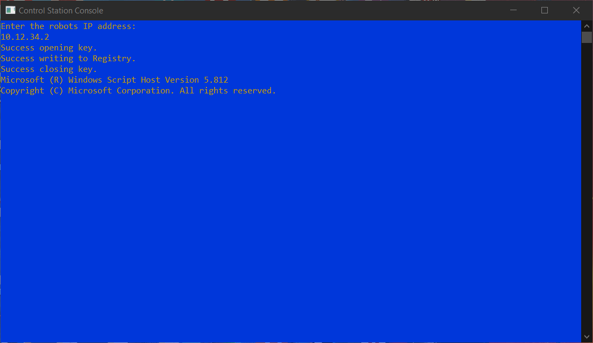

Operation
=========

Using the Control Station Console 
---------------------------------

The control station console is an easy to use program to enable and disable the VMX. To start using the control station console open the ``Control Station Console.exe`` on your desktop or start menu. 

.. figure:: images/operation-1.png
   :alt: Operation start screen
   :align: center
   :width: 80%

The console will ask you to enter your robots IP address. If your team number is ``1234`` then using the format ``10.xx.xx.2`` your IP address will be ``10.12.34.2``. If you have an ethernet connection to the robot the IP address will be ``172.22.11.2``.

The console will then connect the Shuffleboard key to your IP address and launch Shuffleboard for you. 

Control Station Console Main Screen
-----------------------------------

.. figure:: images/operation-3.png
   :alt: Operation main screen
   :align: center
   :width: 80%

1. Battery Voltage Indicator - This will tell you the current voltage of the battery. When the battery starts to approach 11.5V it is time to replace with a charged battery. 

2. Robot Current State - This is the state indicator for the robot. As pictured the robot is in Teleoperated and is Disabled. When the robot is enabled you will see a ``Teleoperated Enabled`` status instead. 

3. IP Address you punched in and what is being used.

4. Quit (q) - press ``q`` on the keyboard to quit. 

5. Set enabled (e,d) - press ``e`` to enable the robot and press ``d`` to disable the robot. 

6. Set Control Mode (o,a,t) - Sets the control mode, currently as pictured the console is in Teleoperated mode.

   - **o** is Teleoperated
   - **a** is Autonomous
   - **t** is Test

7. Status Indicators - These are some flags to show you that connections are present. There are three flags ``Robot Comms``, ``Robot Code``, and ``Joysticks``. 

   - **Robot Comms** will indicate that the console is talking with the robot.
   - **Robot Code** will indicate that there is valid code running on the robot.
   - **Joysticks** will indicate that there is a joystick plugged in.  
