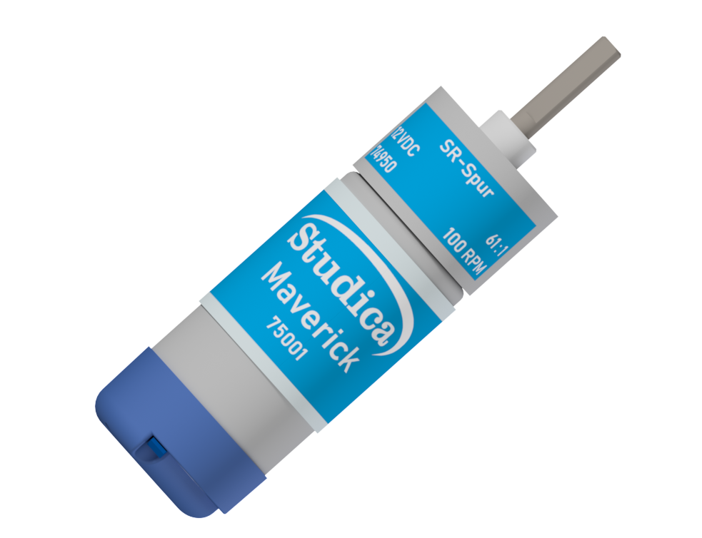

Maverick DC Motor
=================

The Maverick DC Motor is an upgraded 12VDC motor that allows for more torque than the previous motors used in the worldskills collections.

Motor Specs
-----------

.. list-table:: Motor Specs
    :widths: 30 10 10 10
    :header-rows: 1
    :align: center

    * - Function
      - Min
      - Nom
      - Max
    * - Input Voltage
      - ---
      - 12VDC
      - ---
    * - Gear Ratio
      - ---
      - 1:61
      - ---
    * - No Load RPM
      - 88
      - 100
      - 112
    * - No Load Current
      - ---
      - 600mA
      - ---
    * - Rated Speed
      - 68
      - 80
      - 92
    * - Rated Current
      - ---
      - ---
      - 2.5A
    * - Rated Torque
      - ---
      - 139oz-in
      - ---
    * - Stall Current
      - ---
      - ---
      - 13A
    * - Stall Torque
      - 903oz-in
      - ---
      - ---
    * - Direction
      - ---
      - CW
      - ---
    * - Encoder Voltage
      - 4
      - ---
      - 5
    * - Encoder Current
      - ---
      - 6mA 
      - ---