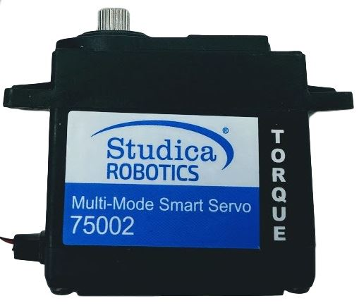

Servo Motors
============

The collection now has a Multi-Mode Smart Servo included. The new servo will replace the old servos and provide more functionality than before. The multi-mode servo allows for continuous and standard operation of the servo motor. In continuous mode, the servo will spin proportionally based on input in the CW or CCW direction. The max speed the servo will spin is 50rpm. In standard mode, the servo will act as a regular servo and have a range of motion of 300°. That is 150° CW and 150° CCW.

Servo Specs
-----------

.. list-table:: Mechanical Specs
    :widths: 30 30
    :header-rows: 1
    :align: center

    * - Function
      - Range
    * - Size
      - 40mm x 20.1mm x 38.3mm x 54mm
    * - Weight
      - 64g
    * - Gear Type
      - Steel 
    * - Bearing
      - Dual Ball Bearings
    * - Spline
      - 25T
    * - Case
      - Nylon & Fiberglass
    * - Connector Wire
      - 750mm ± 5mm (White, Red, Black)
    * - Motor
      - Metal Brush Motor
    * - Water Resistance
      - No 

.. list-table:: Electrical Specs
    :widths: 30 20 20
    :header-rows: 1
    :align: center

    * - Function
      - 4.8V
      - 6.0V
    * - Idle Current
      - 5mA
      - 7mA
    * - No Load Speed
      - 0.25sec/60°
      - 0.2sec/60°
    * - Running Current
      - 130mA
      - 150mA
    * - Stall Torque
      - 180.85oz-in 
      - 300oz-in 
    * - Stall Current
      - 1500mA
      - 1800mA

.. list-table:: Control Specs
    :widths: 30 30
    :header-rows: 1
    :align: center

    * - Function
      - Spec
    * - Command Signal
      - Pulse Width Modulation
    * - Amplifier Type
      - Digital Comparator
    * - Pulse Width Range
      - 500μS ~ 2500μS
    * - Neutral Position
      - 1500μS
    * - Range of Motion 
      - 300° ± 5°
    * - Dead band width 
      - 4μS
    * - Rotating Direction
      - CW

.. list-table:: Enviromental Conditions
    :widths: 30 30
    :header-rows: 1
    :align: center

    * - Function
      - Range
    * - Storage Temperature
      - -30°C ~ 80°C
    * - Operating Temperature
      - -15°C ~ 70°C

.. list-table:: Standard Enviroment
    :widths: 30 30
    :header-rows: 1
    :align: center

    * - Function
      - Range
    * - Temperature
      - 25°C ± 5°C
    * - Humidity
      - 65% ± 10%

Programming
-----------

Standard Servo
^^^^^^^^^^^^^^

.. tabs::
   
    .. tab:: Java

        .. code-block:: java
            :linenos:

            //import the Servo Library
            import com.studica.frc.Servo;

            //Create the Servo Object
            private Servo servo;

            //Constuct a new instance
            servo = new Servo(port);

            //Can then use this mutator to set the servo angle
            servo.setAngle(degrees); //Range 0° - 300°
    
        The mutator method will allow you to set the angle of the servo

    .. tab:: C++

        .. code-block:: c++
            :linenos:

            //Include the Servo Library
            #include "studica/Servo.h"

            //Constructor
            studica::Servo servo{port};

            //Use this function to set the servo angle
            servo.SetAngle(degrees); //Range 0° - 300°

        The function will allow you to set the angle of the servo
        
    .. tab:: Roscpp

        .. code-block:: c++  
         :linenos:
         
         //Include the Servo Library
         #include "Servo_ros.h"
         
         
         double servo_angle;
         
         // Returns the angle value set by the Servo motor
         void servo_angle_callback(const std_msgs::Float32::ConstPtr& msg)
         {
            servo_angle = msg->data;
         }
         
         int main(int argc, char **argv)
         {
            system("/usr/local/frc/bin/frcKillRobot.sh"); //Terminal call to kill the robot manager used for WPILib before running the executable.
            ros::init(argc, argv, "servo_node");
            
            /**
             * Constructor
             * Servo's ros threads (publishers and services) will run asynchronously in the background
             */
             
            ros::NodeHandle nh; //internal reference to the ROS node that the program will use to interact with the ROS system
            VMXPi vmx(true, (uint8_t)50); //realtime bool and the update rate to use for the VMXPi AHRS/IMU interface, default is 50hz within a valid range of 4-200Hz
            
            ros::ServiceClient setAngle;
            ros::Subsrciber servo_angle_sub;
            
            ServoRos servo(&nh, &vmx, channel);

            // Use these to directly access data
            servo.GetAngle(); //returns a double;
            servo.GetMinAngle(); //returns a double
            servo.GetMaxAngle(); //returns a double
            
            // Declaring message type
            vmxpi_ros::Float msg;
            
            // Setting the servo angle
            float angle = 45.0 //Range -150° - 150°
            msg.request.data = angle;
            setAngle.call(msg);
            
            // Subscribing to Servo angle topic to access the angle data
            servo_angle_sub = nh.subscribe("channel/channel_index/servo/angle", 1, servo_angle_callback);
           
            ros::spin(); //ros::spin() will enter a loop, pumping callbacks to obtain the latest sensor data
               
            return 0;
         }
         
        .. important:: Subscribe to Servo topics to access the data being published and write callbacks to pass messages between various processes.
        
        .. note:: Calling the ``frcKillRobot.sh`` script is necessary since the VMXPi HAL uses the pigpio library, which unfortunately can only be used in one process. Thus, everything that interfaces with the VMXPi must be run on the same executable. For more information on programming with ROS, refer to: `ROS Tutorials <http://wiki.ros.org/ROS/Tutorials>`__.
        
Continuous Servo
^^^^^^^^^^^^^^^^

.. tabs::
   
    .. tab:: Java

        .. code-block:: java
            :linenos:

            //import the Servo Continuous Library
            import com.studica.frc.ServoContinous;

            //Create the Servo Continuous Object
            private ServoContinous servo;

            //Constuct a new instance
            servo = new ServoContinuous(port);

            //Can then use this mutator to set the servo speed
            servo.set(speed); //Range -1 - 1 (0 Stop)
    
        The mutator method will allow you to set the speed of the servo

    .. tab:: C++

        .. code-block:: c++
            :linenos:

            //Include the Servo Library
            #include "studica/ServoContinuous.h"

            //Constructor
            studica::ServoContinuous servo{port};

            //Use this function to set the servo angle
            servo.Set(speed); //Range -1 - 1 (0 Stop)

        The function will allow you to set the speed of the servo