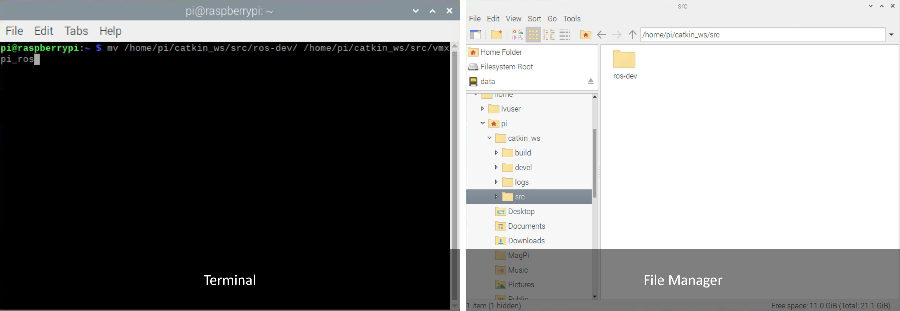
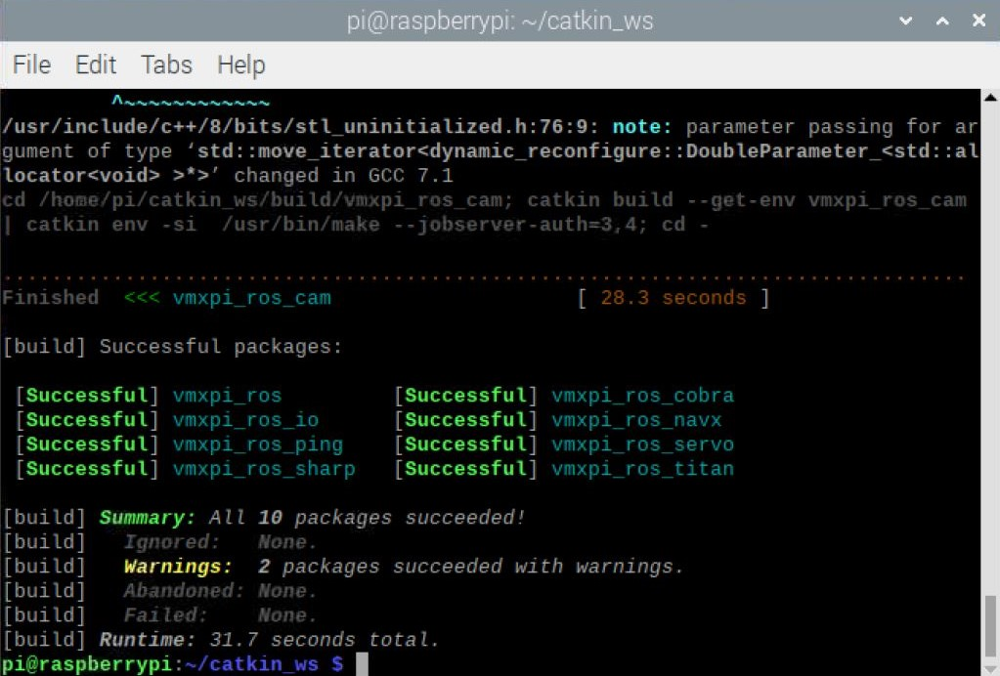

Configuring the ROS Environment
===============================

1. Permanently source the setup.bash files by running the following:

.. code-block:: rst
   
   echo "source /opt/ros/noetic/setup.bash" >> ~/.profile
   echo "source /opt/ros/noetic/setup.bash" >> ~/.bashrc
   echo "source /home/pi/catkin_ws/devel/setup.bash" >> ~/.profile
   echo "source /home/pi/catkin_ws/devel/setup.bash" >> ~/.bashrc
   
2. Close the terminal and open a new one.

3. Navigate to the work space ``cd catkin_ws/src``

4. Change the name of the ``VMX-ROS`` folder to ``vmxpi_ros``

.. code-block:: rst
   
   mv /home/pi/catkin_ws/src/VMX-ROS/ /home/pi/catkin_ws/src/vmxpi_ros
   

5. To build the packages run ``catkin build -cs``. Note, this may take a while as the command builds all the packages in the catkin workspace.

.. code-block:: rst
   
   catkin build -cs

    
.. note:: This process may take a couple minutes if running for the first time.

With everything built, you can begin running the node.