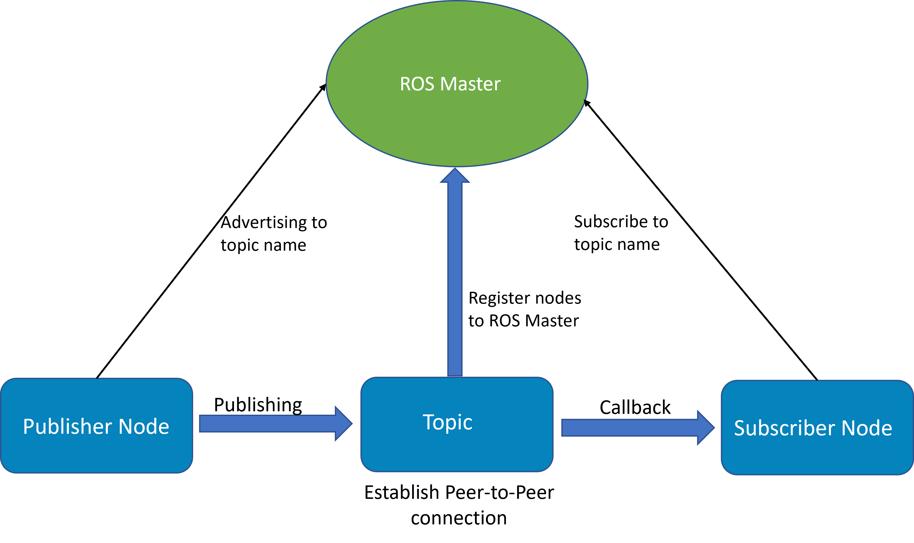
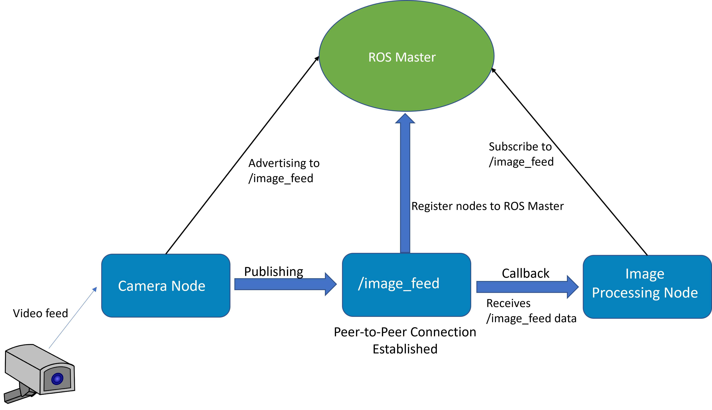
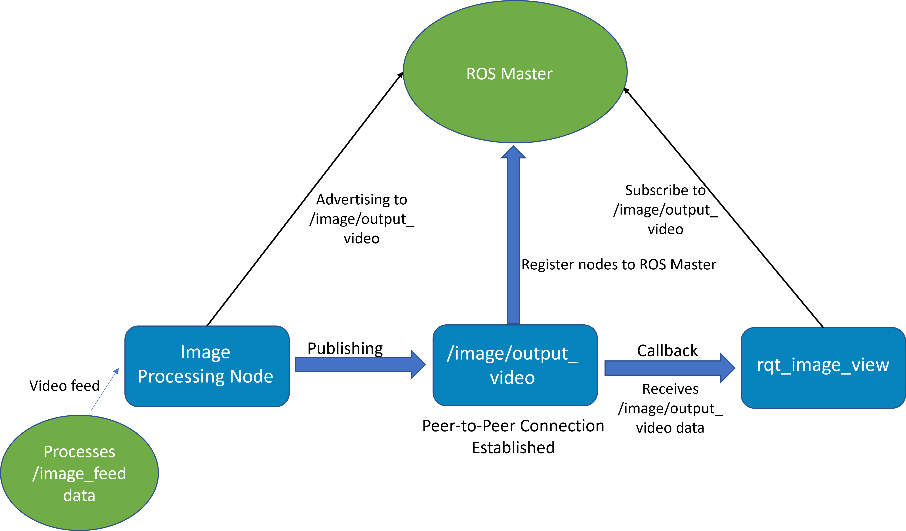
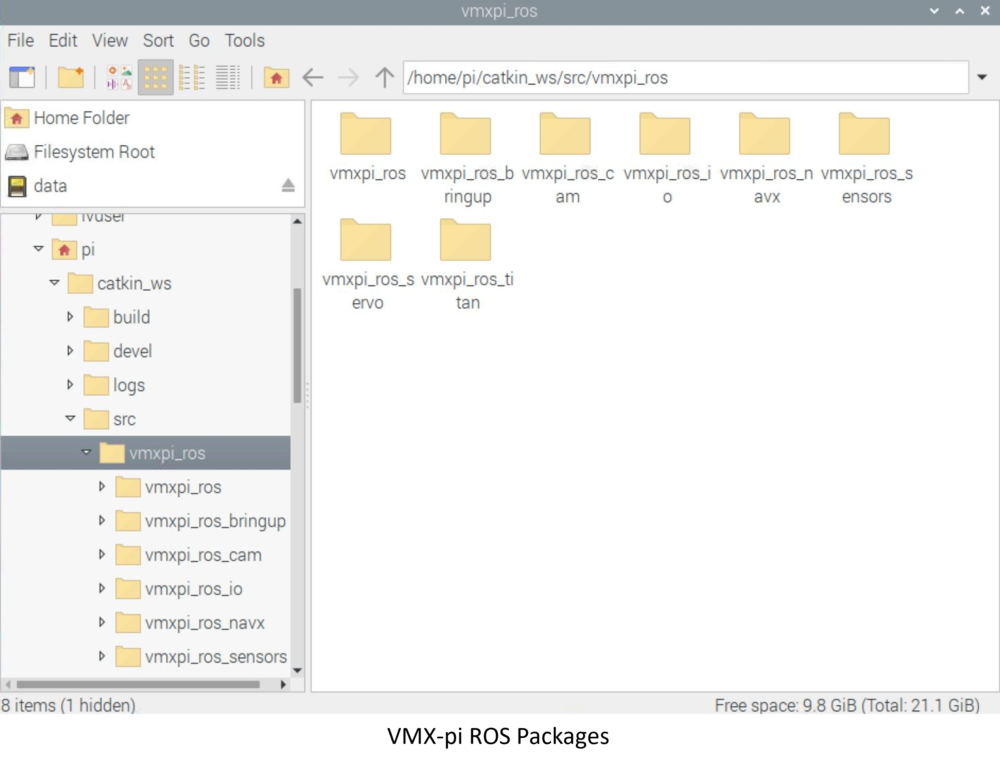

The ROS Package
===============

What is ROS?
------------

ROS (Robot Operating System) is an open-source operating system that allows for functionalities such as low-level device control, message-passing between processes, and package management. The tools and libraries available make it possible to build, write, and run code across multiple computers. The main advantage of ROS is its peer-to-peer network, this allows for communication across multiple nodes and devices without requiring an auxilliary server computer or server software. This means processes distributed across various machines can interact using the ROS communication framework.

General Overview
----------------

Exchanging information with ROS can take many forms, whether it be asynchronously streaming data over topics, or using ROS services via a request/response messaging system.

ROS Master
^^^^^^^^^^

ROS master can be thought of as the main message-passing server that tracks the network addresses of all the other nodes. It informs subscribers about nodes publishing on a particular topic in order for the subscriber and publisher to establish a peer-to-peer connection. The nodes must know the location of ROS master on startup via ROS_MASTER_URI, which is the enviroment variable responsible for this. Conveniently this is automatically set by default when the ROSDISTRO(noetic) setup file is sourced. For more information on sourcing setup files, refer to the ``Getting Started`` section.

Subscribers and Publishers
^^^^^^^^^^^^^^^^^^^^^^^^^^

Like previously mentioned, the subscribe/publish messaging model is one of the main ways ROS is used. For example, let's assume we have a camera on our robot and we want a way to read, process, and ouput the image feed from the camera for navigation or object tracking. To begin, the nodes must register with ROS master, this is the hub where the message-passing will occur. After registering, the Camera Node will advertise the image data to a trivial topic /image_feed.

    
With Peer-to-Peer connection now established, its time for the Image Processing Node to process the incoming video stream and output to another topic called /image/output_video.

Another subscriber can be written to view the video feed by writing a callback to the image output topic, however ROS has a framework known as rqt with many plugins like ``rqt_image_view``, that provides a GUI for displaying images using image transport.

.. note:: Refer to the RQT section for more information on the rqt GUI and its plugins.

Services and Clients
^^^^^^^^^^^^^^^^^^^^

VMX-pi ROS Package
------------------
After following the steps in the Getting Started section, now you are ready to start using the ROS library for the Studica Robot Platform. ROS functionaly has been implemented for a variety of Studica's hardware, refer to Studica's `Roscpp API <LINK>`__ for more information on the classes and methods available. Below are the ROS pacakages:

    
The next sections will go over using the ROS package to write simple subscribers and publishers, as well as writing simple services and clients to pass messages between nodes.