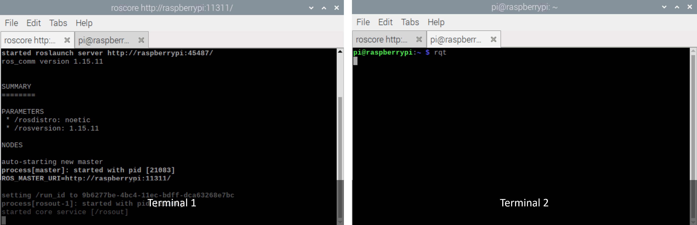
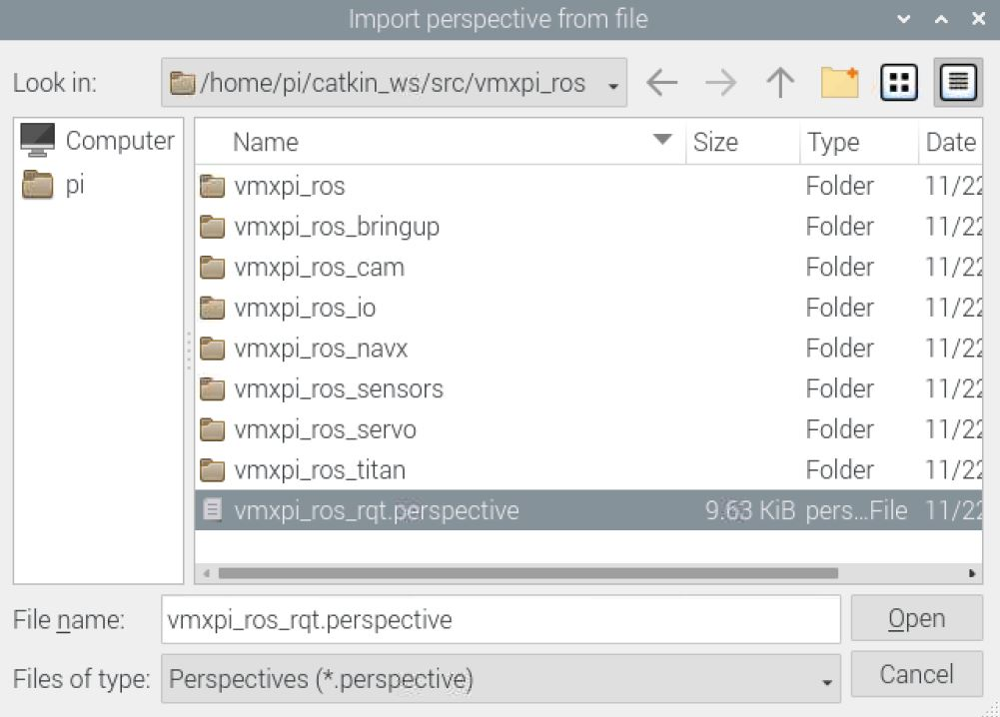
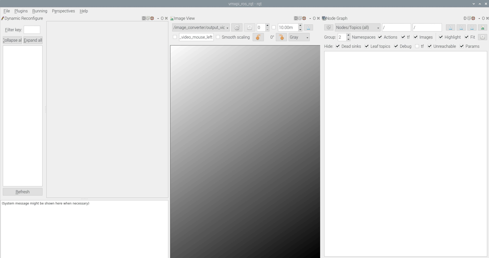

RQT
===

What is RQT?
------------

RQT is one of the many software frameworks of ROS that developers use to implement various plugins to form a graphical user interface (GUI) for the ROS system. These GUIs can be open as individual windows in rqt making it simple to manage various processes at the same time. Running the ROS image srcript ``installNoetic.sh`` includes the rqt tool, there are common plugins already available available such as ``rqt_image_view`` for displaying images, ``rqt_graph`` for viewing the network of node graphs, and ``rqt_plot`` for a visual representation of a 2-D plot.

In the package repository, there is a perspective file that includes GUIs for Dynamic Reconfigure, Image View, and Node Graph plugins. To open this perspective file, refer to the following instructions below.

There are two ways of loading the ``vmxpi_ros_rqt.perspective`` file:

1. RQT GUI
   
- Run ``rqt`` in the command line ensuring ``roscore`` is running in another terminal in the background

.. code-block:: rst
   
   rqt

    
- Navigate to the Perspectives tab

.. figure:: images/rqt-perspectives.JPG
    :align: center
    :width: 80%
    
- Select ``Import...`` from the dropdown
- Navigate to the location of the ``vmxpi_ros_rqt.perspective`` file and open it

From the dashboard, three windows should appear containing the Dynamic Reconfigure, Image View, and Node Graph GUIs.

2. From the Command Line

- Open a terminal and run ``roscore``

.. code-block:: rst

   roscore
   
- Open another terminal and run 

.. code-block:: rst

   rqt --perspective-file "/home/pi/catkin_ws/src/vmxpi_ros/vmxpi_ros_rqt.perspective"
   
After running the command, the rqt dashboard will appear with the GUIs of the same three plugins already opened as dockable windows.