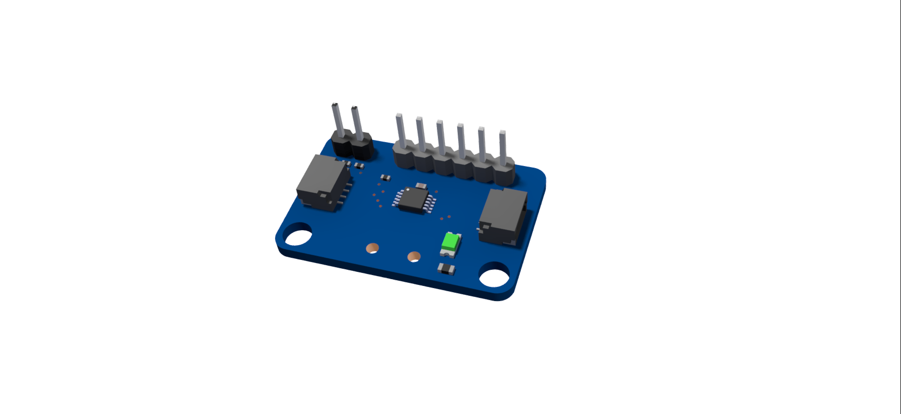

Cobra 
=====

The Cobra Line Follower provides an array of line IR reflective sensors to be used for detecting a line. The Cobra uses four QRE1113 sensors for detecting the line. 

.. figure:: images/cobra-1.jpg
    :align: center

.. list-table:: Electrical Characteristics
    :widths: 30 10 10 10
    :header-rows: 1
    :align: center
   
    *  - Function
       - Min
       - Nom
       - Max
    *  - Input Voltage
       - 3.3VDC
       - 5VDC
       - 5VDC
    *  - Current
       - 25mA
       - 70mA
       - 100mA
    *  - Sensing Distance
       - 2mm
       - 3mm
       - ---

Analog Module
-------------

To plug the Cobra into the VMXpi the analog module is required. 

The Cobra will plug directly into the analog module. The module will then use the provided JST SH to JST GH cable to connect to the ``i2c`` port on the VMXpi. 

Programming the Cobra
---------------------

.. tabs::
   
    .. tab:: Java

        .. code-block:: java
            :linenos:

            //import the Cobra Library
            import com.studica.frc.Cobra;

            //Create the Cobra Object
            private Cobra cobra;

            //Constuct a new instance
            cobra = new Cobra();
            // or if sensor is using 3.3V
            cobra = new Cobra(3.3F);

            //Can then use these accssors to get data
            cobra.getVoltage(channel); //returns a float
            cobra.getRawValue(channel); //returns a double
    
        The accessor methods will output either the voltage (0 - 5V) or the raw ADC value (0 - 2047).

    .. tab:: C++

        .. code-block:: c++
            :linenos:

            //Include the Cobra Library
            #include "studica/Cobra.h"

            //Constructors
            studica::Cobra cobra{};
            // or if sensor is using 3.3V
            studica::Cobra cobra{3.3F}; 

            //Use these to access data
            cobra.GetVoltage(channel); //returns a float
            cobra.GetRawValue(channel); //returns a double

        The accessor functions will output either the voltage (0 - 5V) or the raw ADC value (0 - 2047).
        
    .. tab:: Roscpp
    
        .. code-block:: c++
            :linenos:
            
            //Include the Cobra Library
            #include "Cobra_ros.h"
            
            //Running Cobra publishers
            void runCobra(CobraROS *cobra) {
               cobra->Run_t();
            }
            
            //int main(int argc, char **argv)
            
            //Constructors
            CobraROS cobra(&nh, &vmx);
            
            //Function call to run cobra's ros threads asynschronously
            std::thread cobrarunth(runCobra, &cobra);
            
            //Use these to access data
            cobra.GetVoltage(channel); //returns a float
            cobra.GetRawValue(channel); //returns an int
            
        .. note:: Subscribe to cobra topics to access the data being published and write callbacks to pass messages between various processes.