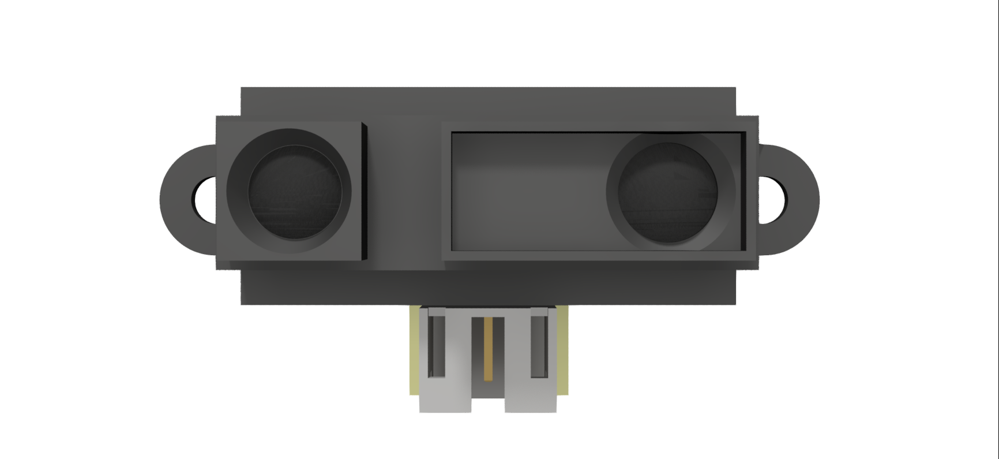

Sharp IR Distance Sensor
========================

The Sharp GP2Y0A21YK is one of the most reliable and accurate sensors in the collection. The Sharp IR has many benefits that make it one of the best sensors for a robot for distance tracking. 

.. list-table:: Electrical Characteristics
    :widths: 30 10 10 10
    :header-rows: 1
    :align: center
   
    *  - Function
       - Min
       - Nom
       - Max
    *  - Input Voltage
       - 4.5VDC
       - 5V
       - 7VDC
    *  - Output Voltage
       - -0.3VDC
       - ---
       - VIN + 0.3VDC
    *  - Sensing Range
       - 10cm
       - ---
       - 80cm
    *  - Current
       - ---
       - 30mA
       - 40mA
    *  - Operating Temperature
       - -10°C 
       - ---
       - 60°C
    *  - Storage Temperature
       - -40°C
       - ---
       - 70°C

Programming the Sharp IR Sensor
-------------------------------

.. tabs::
   
    .. tab:: Java

        .. code-block:: java
            :linenos:

            //import the Analog Library
            import edu.wpi.first.wpilibj.AnalogInput;

            //Create the Analog Object
            private AnalogInput sharp;

            //Constuct a new instance
            sharp = new AnalogInput(port);

            //Create an accessor method
            public double getDistance()
            {
                return (Math.pow(sharp.getAverageVoltage(), -1.2045)) * 27.726;
            }
    
        The accessor method will output the range in cm.

        .. note:: The valid Analog ports are ``0-3`` 

    .. tab:: C++

        .. code-block:: c++
            :linenos:

            //Include the Analog and Math Library
            #include "frc/AnalogInput.h"
            #include <cmath>

            //Constructors
            frc::AnalogInput sharp{port};

            //Create an accessor function
            double getDistance(void)
            {
                return (pow(sharp.GetAverageVoltage(), -1.2045)) * 27.726;
            }

        The accessor function will output the range in cm.  

        .. note:: The valid Analog ports are ``0-3``
        
    .. tab:: Roscpp

        .. code-block:: c++
            :linenos:
            
            //Include the Sharp Library
            #include "Sharp_ros.h"
            
            
            double sharp_dist;
            
            // Returns the distance value reported by the Sharp IR sensor
            void sharp_dist_callback(const std_msgs::Float32::ConstPtr& msg)
            {
               sharp_dist = msg->data;
            }
            
            int main(int argc, char **argv)
            {
               system("/usr/local/frc/bin/frcKillRobot.sh"); //Terminal call to kill the robot manager used for WPILib before running the executable.
               ros::init(argc, argv, "sharp_node");
               
               /**
                * Constructor
                * Sharp's ros threads (publishers and services) will run asynchronously in the background
                */
                
               ros::NodeHandle nh; //internal reference to the ROS node that the program will use to interact with the ROS system
               VMXPi vmx(true, (uint8_t)50); //realtime bool and the update rate to use for the VMXPi AHRS/IMU interface, default is 50hz within a valid range of 4-200Hz
               
               ros::Subscriber sharpDist_sub;
               
               SharpROS sharp(&nh, &vmx);
               // or can use
               SharpROS sharp(&nh, &vmx, channel);
               
               //Use these to directly access the data
               double dist_cm = sharp.GetIRDistance(); //converts the average voltage read, outputs the range in cm
               double voltage = sharp.GetRawVoltage(); //returns the average voltage
               
               // Subscribing to Sharp distance topic to access the distance data
               sharpDist_sub = nh.subscribe("channel/22/sharp_ir/dist", 1, sharp_dist_callback);
                
               ros::spin(); //ros::spin() will enter a loop, pumping callbacks to obtain the latest sensor data
               
               return 0;
            }
             
        The valid Analog channels are ``22-25``. These are different from the WPI Analog Input Channels.

        .. important:: Subscribe to Sharp topics to access the data being published and write callbacks to pass messages between various processes.
        
        .. note:: Calling the ``frcKillRobot.sh`` script is necessary since the VMXPi HAL uses the pigpio library, which unfortunately can only be used in one process. Thus, everything that interfaces with the VMXPi must be run on the same executable. For more information on programming with ROS, refer to: `ROS Tutorials <http://wiki.ros.org/ROS/Tutorials>`__.
        
        