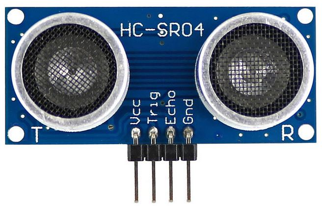

Ultrasonic Distance Sensor
==========================

The Ultrasonic Distance Sensor has been updated from a 3-pin to a 4-pin sensor. This was done to create better compatiblity between multiple different control systems. 

.. list-table:: Electrical Characteristics
    :widths: 30 10 10 10
    :header-rows: 1
    :align: center
   
    *  - Function
       - Min
       - Nom
       - Max
    *  - Input Voltage
       - ---
       - ---
       - 5VDC
    *  - Current
       - ---
       - 15mA
       - ---
    *  - Range
       - 2cm
       - ---
       - 400cm
    *  - Measure Angle
       - ---
       - 15°
       - ---
    *  - Frequency
       - ---
       - 40Hz
       - ---
    *  - Trigger Pulse
       - ---
       - 10μS TTL 
       - ---

Programming the Ultrasonic Distance Sensor
------------------------------------------

.. tabs::
   
    .. tab:: Java

        .. code-block:: java
            :linenos:

            //import the Ultrasonic Library
            import edu.wpi.first.wpilibj.Ultrasonic;

            //Create the Ultrasonic Object
            private Ultrasonic sonar;

            //Constuct a new instance
            sonar = new Ultrasonic(Trigger, Echo);

            //Create an accessor method
            public double getDistance()
            {
                return sonar.getRangeInches();
                // or can use 
                return sonar.getRangeMM();
            }
    
        The accessor methods will then output the range in either inches or mm.

        .. note:: The valid digital pairs for Trigger and Echo pins are (Trigger, Echo) ``(0,1)``, ``(2,3)``, ``(4,5)``, ``(6,7)``, ``(8, 9)``, ``(10,11)``

    .. tab:: C++

        .. code-block:: c++
            :linenos:

            //Include the Ultrasonic Library
            #include "frc/Ultrasonic.h"

            //Constructors
            frc::Ultrasonic sonar{Trigger, Echo};

            //Create an accessor function
            double getDistance(void)
            {
                return sonar.GetRangeInches();
                // or can use 
                return sonar.GetRangeMM();
            }

        The accessor functions will then output the range in either inches or mm.  

        .. note:: The valid digital pairs for Trigger and Echo pins are (Trigger, Echo) ``(0,1)``, ``(2,3)``, ``(4,5)``, ``(6,7)``, ``(8, 9)``, ``(10,11)``
     
    .. tab:: Roscpp
     
        .. code-block:: c++
            :linenos:
            
            //Include the Ping Library
            #include "Ping_ros.h"
            
            
            double ping_dist_cm;
            
            // Returns the distance value reported by the Ultrasonic Distance sensor
            void ping_cm_callback(const std_msgs::Float32::ConstPtr& msg)
            {
               ping__dist_cm = msg->data;
            }
            
            int main(int argc, char **argv
            {
            
               ros::init(argc, argv, "ping_node");
               
               /**
                * Constructor
                * Ping's ros threads (publishers and services) will run asynchronously in the background
                */
                
               ros::NodeHandle nh; //internal reference to the ROS node that the program will use to interact with the ROS system
               VMXPi vmx(true, (uint8_t)50); //realtime bool and the update rate to use for the VMXPi AHRS/IMU interface, default is 50hz within a valid range of 4-200Hz
               
               ros::Subsriber pingCM_sub;
               
               PingROS ultrasonic(&nh, &vmx, 8, 9); //channel_index_out(8), channel_index_in(9)
               ultrasonic.Ping(); //Sends an ultrasonic pulse for the ultrasonic object to read
               
               // Use these to directly access data
               uint32_t distance = ultrasonic.GetRawValue();
               
               ultrasonic.GetRawValue(); // returns distance in microseconds
               // or can use
               ultrasonic.GetDistanceCM(distance); //converts microsecond distance from GetRawValue() to CM
               // or can use
               ultrasonic.GetDistanceIN(distance); //converts microsecond distance from GetRawValue() to IN
               
               // Subscribing to Ping distance topic to access the distance data
               pingCM_sub = nh.subscribe("channel/9/ping/dist/cm", 1, ping_cm_callback); //This is subscribing to channel 9, which is the input channel set in the constructor               
               ros::spin(); //ros::spin() will enter a loop, pumping callbacks to obtain the latest sensor data
               
               return 0;
            }
         
        The accessor functions will then output the range in either microseconds, inches, or cm.  

        .. note:: The valid digital pairs for Trigger and Echo pins are (Trigger, Echo) ``(0,1)``, ``(2,3)``, ``(4,5)``, ``(6,7)``, ``(8, 9)``, ``(10,11)``
        
        .. important:: Subscribe to Ping topics to access the data being published and write callbacks to pass messages between various processes. For more information on programming with ROS, refer to: http://wiki.ros.org/ROS/Tutorials.