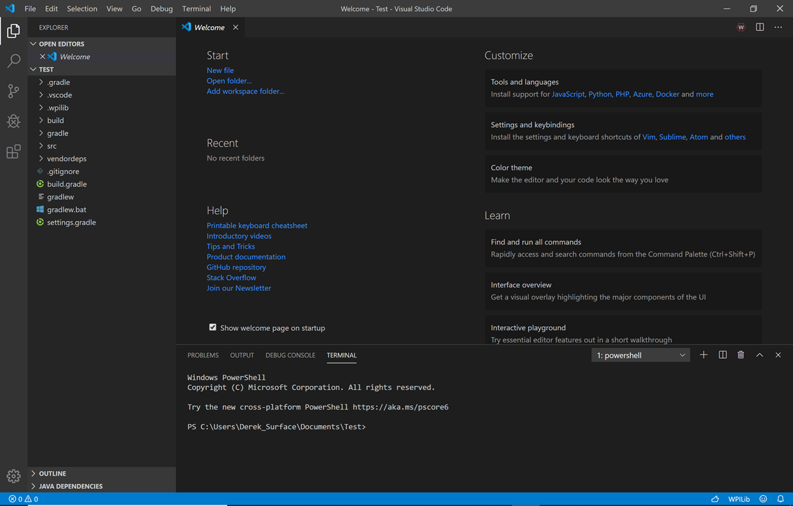

Getting to Know VS Code
=======================

This guide will show you how to navigate VS Code along with some helpful hints

Microsoft’s Visual Studio Code is the supported IDE for C++ and Java development for WorldSkills Mobile Robotics. This section introduces some of the basics of using Visual Studio Code and the WPILib extension.

Welcome Page
------------

When Visual Studio Code first opens, you are presented with a Welcome page. On this page you will find some quick links that allow you to customize Visual Studio Code as well as several links to help documents and videos that may help you learn about the basics of the IDE as well as some tips and tricks.

You may also notice a small WPILib logo way up in the top right corner. This is one way to access the features provided by the WPILib extension (discussed further below).

1.	The icons on the left edge make up the “Activity Bar”.  Clicking on the icons will open the “Sidebar” which offers more functions.
2.	The icon on top opens the “Explorer” sidebar which shows all the files that you can edit. This should already be open when you open the IDE using the FRC VSCode shortcut.
3.	The squarish icon on bottom opens the “Extension” sidebar, which lets you manage software extensions for VSCode.
4.	Hitting control-B (or command-B on a Mac) will toggle away the sidebar, so you can make full use of screen space.
5.	Holding the control key down and hitting the back-quote character will open a terminal panel on the lower part of the screen.  (The back-quote character is usually in the upper left corner of your keyboard, just under the Esc key).   You’ll probably need to get comfortable with terminals and command lines when developing with VSCode.
6.	Hitting control-back-quote again will toggle the terminal away.
7.	The F1 key will open the “Command Palette” at the top of the screen.  Also, you can hit control-shift-P on Windows or Linux.  Macintosh users can hit Command-Shift-P.  The Command Palette lets you invoke special commands inside VSCode.  It’s pretty good about offering you suggestions for what you want to do.  Many of these functions are available from menus or from keyboard shortcuts, but you’ll find yourself using the Command Palette a lot.
8.	Almost everything in VSCode is going to be controlled through the command palette, everything from making a new project in WPILib to changing the setting of the editor, to debug, to building, etc.

The FRC extension for WPILib adds new commands to the Command Palette for building robot code and reconfiguring your robot development environment.

Everything that you add to the editor is going to be done though extensions, so everything that you want to install for example such as C++ or the debugger for Java is also installed here. Also, the WPILib which is the basic library. 

The second portion if the UI will be the sidebar, so in the sidebar you have all your files, so any files that you have open, or projects that you have open. The folder will be here which is basically your project and anything that you are currently editing or have open will appear as well.
