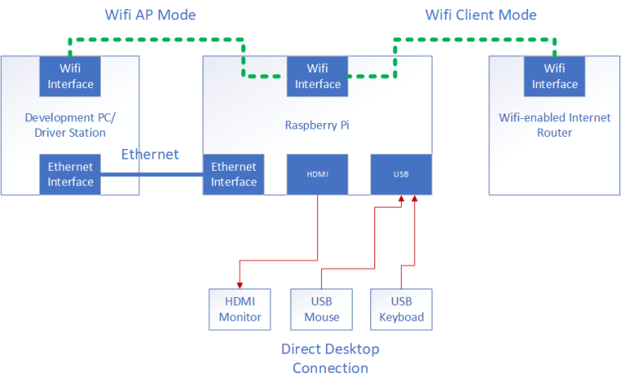
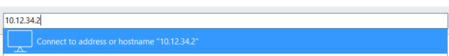
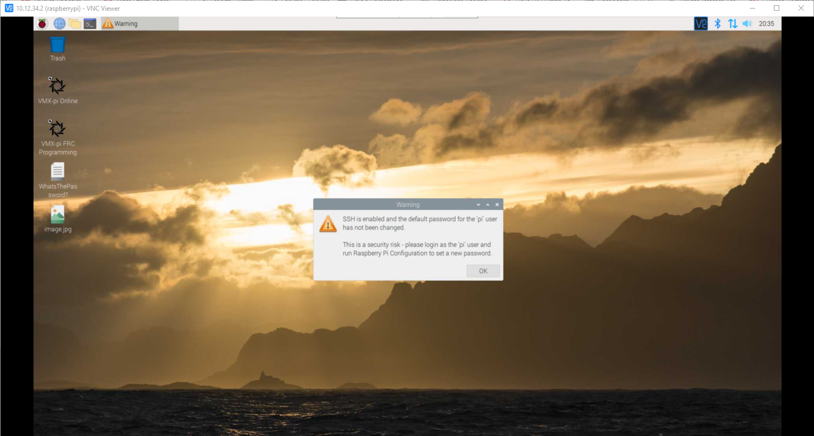
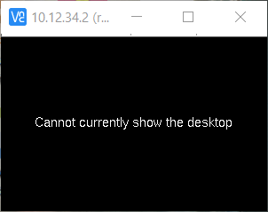
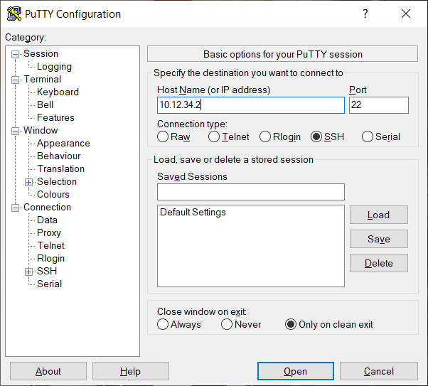
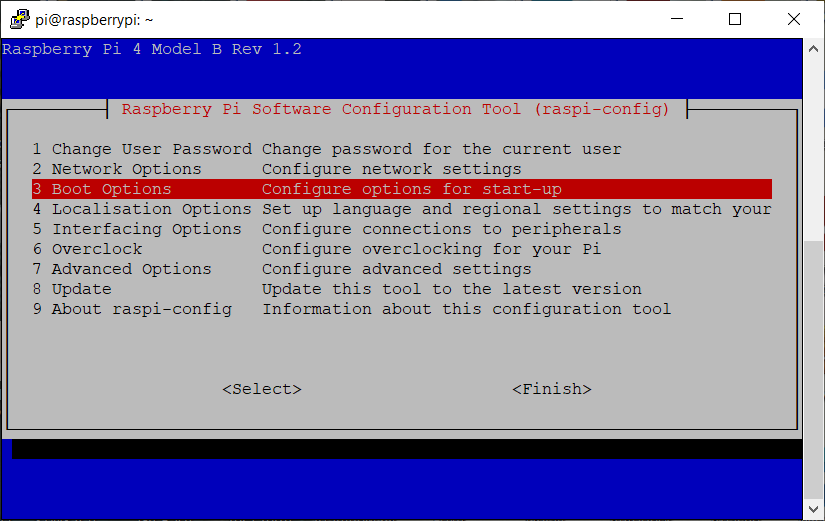
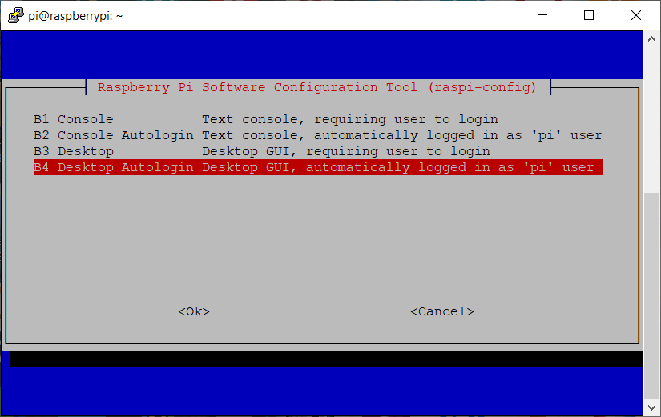
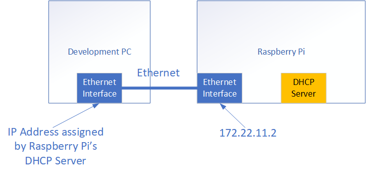

Networking
==========

.. tip:: Out of the box, the VMX will emit a Wi-Fi with an SSID of ``WorldSkills-1234`` and requires a password. The password is ``password``.

The VMX allows for four different types of network connections. 

- Wi-Fi Access Point (AP)
- Wi-Fi Client
- Ethernet
- Direct Desktop Connection 

.. important:: It is always recommended to be in Wi-Fi AP mode. This is a factory default out of the box. 

Remote Desktop Connection
-------------------------

In AP, Client, and Ethernet mode, the VMX can be connected to a remote desktop connection. The preferred remote connection is VNC Viewer, which can be downloaded `here <https://www.realvnc.com/en/connect/download/viewer/>`__. VNC Viewer has the benefit of being able to see the desktop of the VMX without the need for cables plugged into the VMX. 

When first opening the VNC Viewer, it will look like this:

.. figure:: images/networking-2.png
    :align: center

To access the VMX in the address bar, type in the IP address of the VMX.

There will be an identity check error; hit continue.

.. figure:: images/networking-4.png
    :align: center

The login screen will now be visible to login use ``pi`` for username and ``raspberry`` for the password.

.. figure:: images/networking-5.png
    :align: center

You should now have access to the VMX desktop. 

Cannot currently show the desktop
^^^^^^^^^^^^^^^^^^^^^^^^^^^^^^^^^

The **Cannot currently show the desktop** error occurs as the VMX has been set to console boot mode. To fix this, a remote ssh session is required. Using an application such as PuTTY will allow for an ssh connection. 

To start open PuTTY, change the connection type to SSH and enter the VMX's IP address.

A terminal will pop up and ask for the login credentials. Just as before, the username is ``pi`` and the password is ``raspberry``. 

.. note:: PuTTY uses standard networking encryption, so when typing in the password, there will be no text on the screen.

.. figure:: images/networking-9.png
    :align: center

Once logged in, the VMX's terminal will be shown. To make the changes required, we will use raspi-config. Type the following command in to get to raspi-config.

.. code-block:: shell
    
    sudo raspi-config

This will open raspi-config. Navigate using the arrow keys on the keyboard to ``3 Boot Options``.

Select ``B1 Desktop / CLI``.

.. figure:: images/networking-11.png
    :align: center

Choose ``B4 Desktop Autologin``. This will tell the VMX to boot up into the desktop and auto-login for us.

It should now be at the main screen of raspi-config again. There is one last step to fix the error. Select ``7 Advanced Options``.

.. figure:: images/networking-13.png
    :align: center

Select ``A5 Resolution``

.. figure:: images/networking-14.png
    :align: center

And choose any resolution that you want but the default. 

.. figure:: images/networking-15.png
    :align: center

Hit ``ESC`` to get back to the terminal and run the command below to restart the VMX.

.. code-block:: shell

    sudo reboot now

Once rebooted, the VMX should now be accessed by the VNC viewer with the desktop visible. 

Ethernet
--------

The Ethernet port is always available and always on the same IP address. It uses the IP address of ``172.22.11.2``. 

Wi-Fi Access Point (AP)
-----------------------

This is the default always recommended mode to be in. In this mode, the VMX will create its own Wi-Fi and allow a computer to connect. 

.. figure:: images/networking-17.png
    :align: center

In AP mode, the IP address uses the format of ``10.XX.YY.2`` where XXYY corresponds to a four-digit team number. Out of the box, the team number is set to 1234, which will give an IP address of ``10.12.34.2``. 

To change this configuration or put the VMX back into AP mode, run the following command below.

.. code-block:: shell

    setupWifiAP.sh SSID TEAMNUMBER PASSWORD 

Where:

- SSID is the prefix for the name of the Wi-Fi.
- TEAMNUMBER is the four-digit team number.
- PASSWORD is an optional add-on that allows you to create a password for the Wi-Fi.

.. important:: At a worldskills competition, passwords will be required!

Out of the box, the Wi-Fi for the VMX will be ``WorldSkills-1234``, and the password is ``password``. In this case the SSID = ``WorldSkills``, the TEAMNUMBER = 1234, and the password = ``password``. To get this, the command will look like this.

.. code-block:: shell

    setupWifiAP.sh WorldSkills 1234 password

Wi-Fi Client
------------

Wi-Fi Client mode allows the VMX to connect to the internet. 

.. figure:: images/networking-18.png
    :align: center
    :width: 80%

To get into client mode, run the command:

.. code-block:: shell

    setupWifiClient.sh

.. important:: Remember when done in client mode to switch back to AP mode. 

Direct Desktop Connection
-------------------------

The direct desktop connection is using the VMX as an average computer. This would entail plugging a keyboard and mouse into the VMX USB ports and then a micro HDMI cable into one of the HDMI ports on the VMX. Usually, this is required when the IP address is unknown, or there is an issue where the networking is not working, and more troubleshooting is needed. 