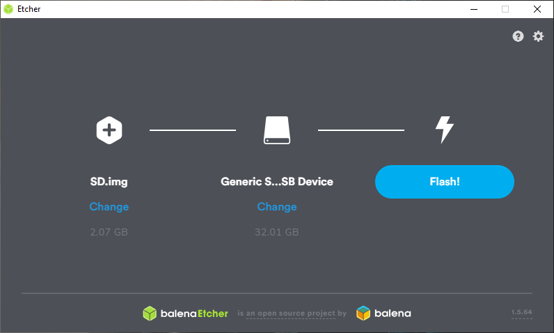

VMX OS Image 
============

The VMX contains a specifically built version of raspbian buster that will run on a raspberry pi. **The prefered raspberry pi is the 4B** however, it will work on the 3B+ and Zero W.

The OS image can be downloaded `here <https://www.studica.com/tdev/vmx/images/SD.img.gz>`__.

.. note:: The image download is 4GB!

Once downloaded a flashing software is required to flash the image to the SD Card. The recommended software to do this is `Etcher <https://www.balena.io/etcher>`__. 

.. important:: It is highly recommended to use a Samsung 32GB EVO Plus micro SD card. 

Flashing 
--------

To start flashing the SD card first plug the SD card into your computer. Open ``Etcher``, you will notice that it has auto detected the SD card. If it has not detected the SD card you can manually select and find it. 

.. figure:: images/os-image-1.png
    :align: center

Hit ``Select image`` and find the ``SD.img.gz`` file that was downloaded before. 

``Flash`` will now be available. Hit Flash to start flashing the SD card image to the SD card. Note this can take a while depending on your computer. The image has been compressed from 32GB to 2.07GB, which also helps in the flashing time. 

.. figure:: images/os-image-3.png
    :align: center

After flashing Etcher will automatically start to validate the flash to ensure that the flash was successful. 

.. figure:: images/os-image-4.png
    :align: center

When complete the SD card will be auto ejected and can be stuck directly back into the VMX.

.. figure:: images/os-image-5.png
    :align: center