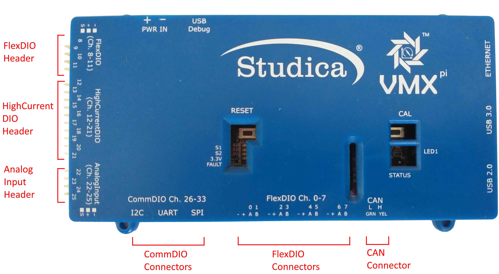
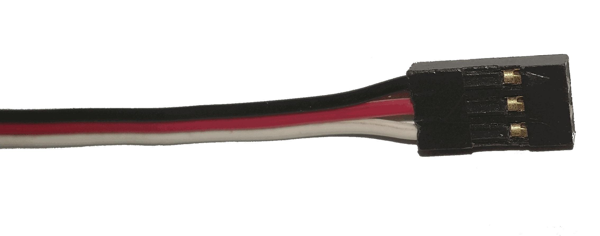
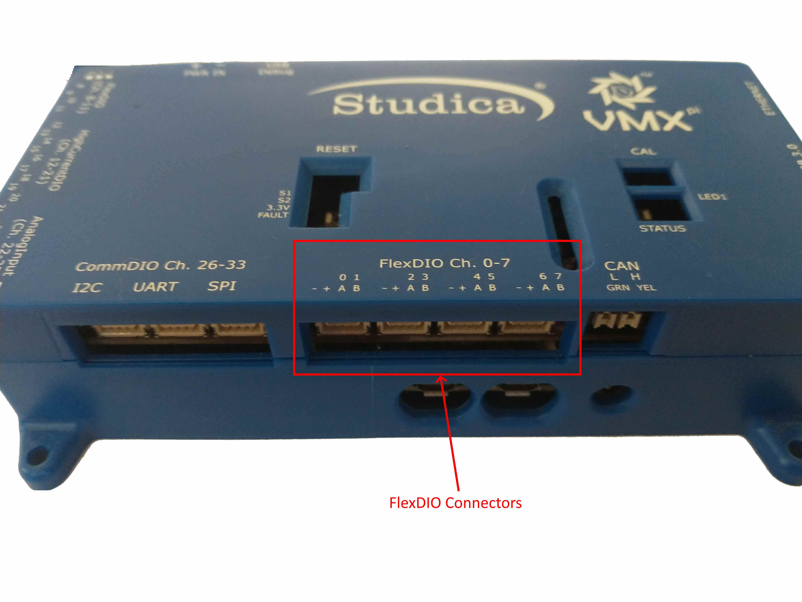
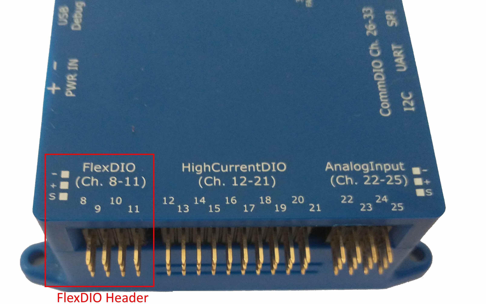
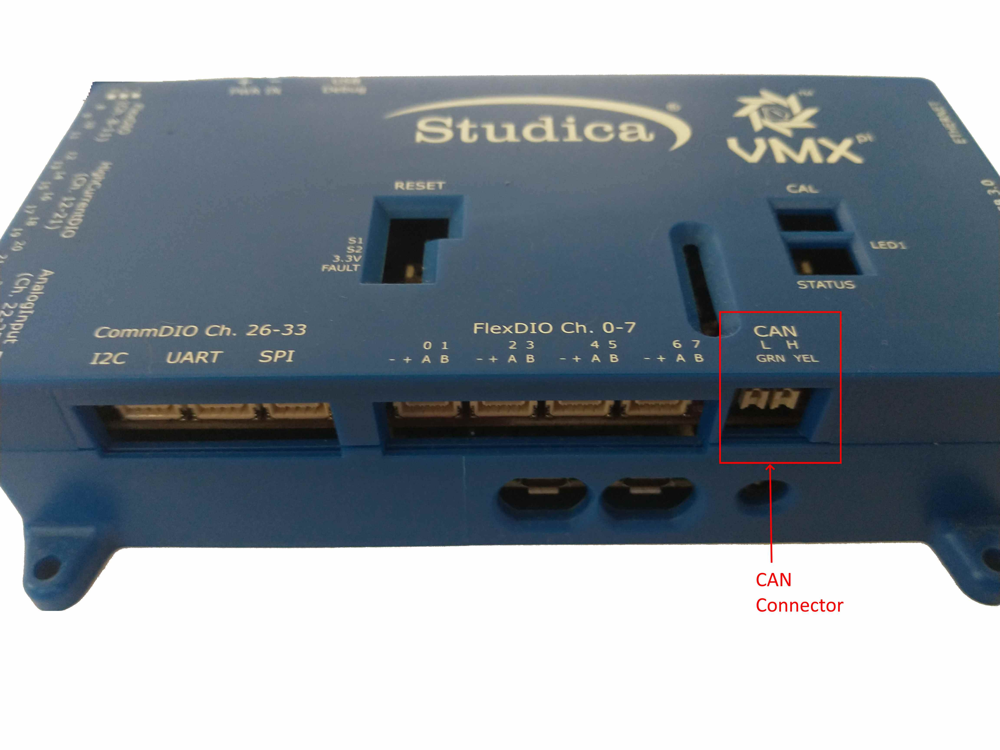
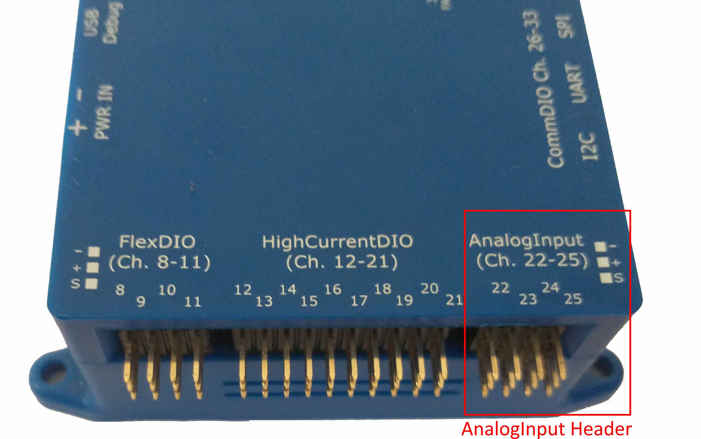
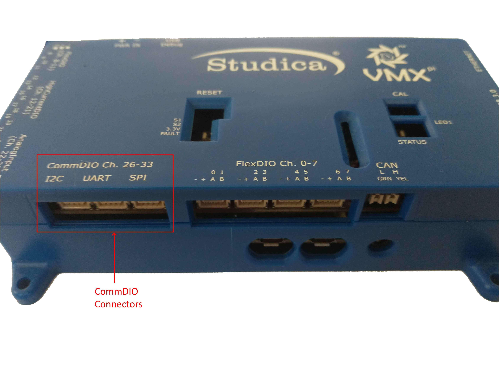
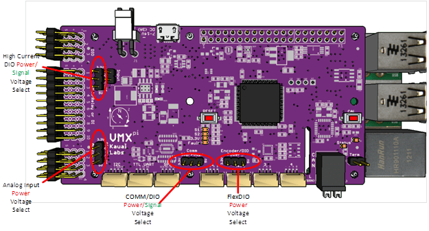

.. _vmx-electrical-wiring:

Connecting Sensors and Actuators
================================
The VMX Robotics Controller provides a large number of electrical power and signal "pins" which connect to external devices including Sensors and Actuators.

.. note:: This summary of VMX IO configuration is sufficient for most robot Programming uses; more detailed information is available in the `Hardware Reference Manual <https://pdocs.kauailabs.com/vmx-pi/intro/hardware-reference-manual/>`__.

   VMX Connector Blocks

VMX provides several different Connector Blocks.

=======================      ===========================  ================
  Connector Block                Connector Type           Location on VMX
=======================      ===========================  ================
Flex DIO Header              3-pin PWM-style              Left-side Top
High Current DIO Header      3-pin PWM-style              Left-side mid
Analog Input Header          3-pin PWM-style              Left-side bottom
Comm DIO Connectors          4-pin JST GH                 Bottom-left
Flex DIO Connectors          4-pin JST GH                 Bottom-middle
CAN Connector                2-wire Weidmuller            Bottom-right
=======================      ===========================  ================

Three (3) types of Connectors are used:

   3-pin PWM-style Connector

.. figure:: images/4Pin_JST_GH_Connector_Edited.png
   :align: center
   :width: 500

   4-pin JST GH Connector

.. figure:: images/CAN_Wire.jpg
   :align: center
   :width: 500

   2-Wire CAN Wire 

`3-pin PWM-style Connectors <https://www.studica.com/ca/en/Worldskills2021/pwm-cable-set-tjc8-3-pin-22awg-f-f-12-pcs_1.html>`_, `JST GH Connectors and Breakout Boards <https://www.studica.com/ca/en/Worldskills2021/vmx-wire-pack.html>`_ and `CAN Wires <https://www.studica.com/ca/en/Worldskills2021/titan-wire-pack.html>`_ are available for purchase online.

FlexDIO Connectors
-----------------------
FlexDIO Connectors are a set of four locking JST GH connectors (4 pins each) with power, ground, signal A and signal B on each connector.  These connectors are designed to support Quadrature Encoders, but may also be configured for use as Digital Inputs, Interrupts, Digital Outputs, PWM Generators or Counters.

   FlexDIO Connectors

FlexDIO Header
-----------------------
The FlexDIO Header provides 4 sets of power, ground, and a single signal channel.  The signals may be configured to support Quadrature Encoders, Digital Inputs, Interrupts, Digital Outputs, PWM Generators or Counters. Note that only 2 of the pins on this header support Quadrature Encoders, see below for details.

   FlexDIO Header

CAN Connector
-------------

The CAN Connector accepts a pair of wires (CANH and CANL signals) with bare ends, which connect to a CAN bus.

   CAN Connector

High-Current DIO Header
-----------------------
The High-Current DIO Header provides 10 sets of power, ground, and a single signal channel.  The signals may be configured to support Digital Inputs, Interrupts, Digital Outputs, PWM Generators or Relays.

.. figure:: images/FlexDIO_HCDIO_And_AnalogIn_Headers_Trimmed_HiCurrDIO_Header_Annotated.jpg
   :align: center
   :width: 500

   High-Current DIO Header

.. note:: The High-Current DIO Header may be configured in either *Output* or *Input* Direction, see below for details.

Analog Input Header
-----------------------
The Analog Input Header provides 4 sets of power, ground, and a single signal channel.  The signals may be configured to support Analog Accumulation and/or Analog-triggered Interrupts.

   Analog Input Header

CommDIO Connectors
-----------------------

The three (3) CommDIO Connectors are three locking JST GH connectors (4 pins each) with different sets of power/ground/signals.  Each connector may be configured to communicate using the corresponding digital communication protocol.  Alternatively, the Input Channels may be configured for use as Digital Inputs or Interrupts; Output Channels may be configured for use as Digital Outputs or PWM.

   CommDIO Connectors

Each of the four pins on each connector have a different definition, depending upon the type:

==========================  ============  =================  ============  ============
I/O Channel Type  Pin 1         Pin 2              Pin 3         Pin 4
==========================  ============  =================  ============  ============
I2C                         Ground        Power (5 or 3.3V)  SDA [OUTPUT]  SCL [OUTPUT]     
TTL UART                    Ground        Power (5 or 3.3V)  TX [OUTPUT]   RX [INPUT]
SPI                         SCK [OUTPUT]  MOSI [OUTPUT]      MISO [INPUT]  CS [OUTPUT]
==========================  ============  =================  ============  ============

.. note:: Unlike the I2C and TTL UART Connectors, the SPI connector has 4 signal pins and does not provide power and ground.

Output Voltage Selection
------------------------

Either 5 or 3.3V power output for external devices (both power and signal level) may be selected for Flex, High Current and Comm DIOs and also for power pins on the Analog Input Header.

   Output Voltage Selection Jumpers

.. caution:: If any of the external devices connected to pins in any of these groups are not 5V tolerant, ensure the voltage selection jumper is set to 3.3V to avoid damage to the external device.

.. note:: The Output Voltage Selection Jumper can only be accessed by opening the VMX enclosure.

High Current DIO Channel Direction configuration
------------------------------------------------
The entire bank of High Current DIOs can be either all outputs (default), or all inputs.  Direction selection is performed in hardware via the High Current DIO Input/Output Jumper.  If the jumper is present, all High Current DIOs function as outputs, otherwise they function as inputs.

Output Configuration: 10 High Current DIO Pins are Digital Outputs
Input Configuration: 10 High Current DIO Pins are Digital Inputs

.. figure:: images/HighCurrentDIODirectionConfiguration.png
   :align: center
   :width: 500

   High Current DIO Channel Direction Jumper

The High Current Direction setting impacts the behavior of PWM, Relay and Digital IO Channels, described further below. Therefore this setting is one of the first things to verify in case of improper operation of the High Current DIO Channels.

.. tip::  Use the default Direction (Output) unless your configuration requires more digital inputs.

.. note:: The Output Voltage Selection Jumper can only be accessed by opening the VMX enclosure.
