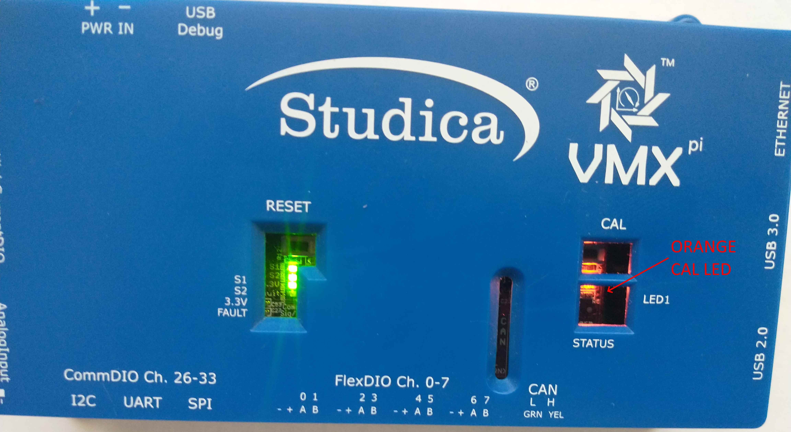
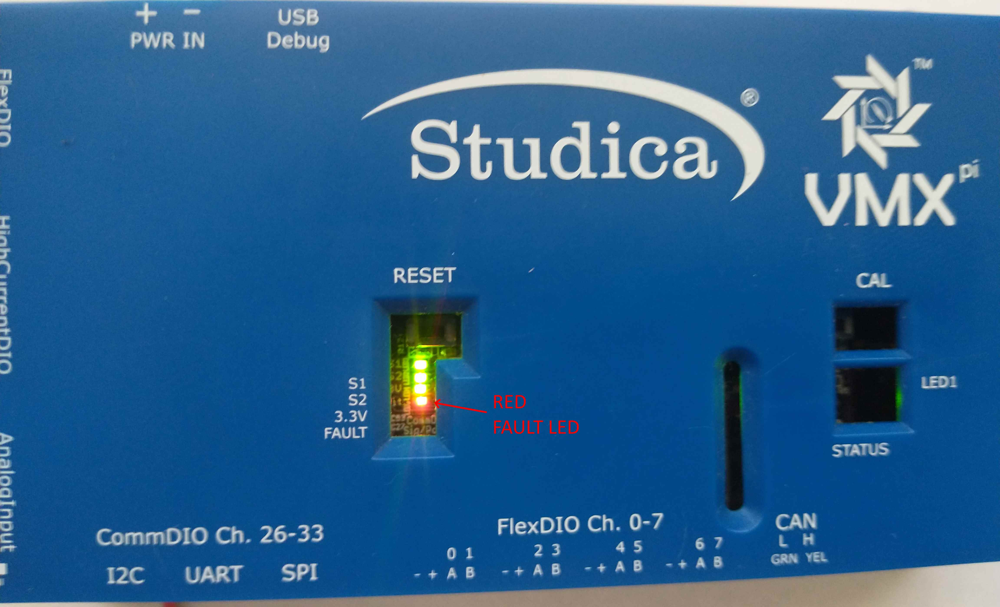

Troubleshooting
===============

VMX LEDs
-----------

VMX provides several LEDS to indicate when it is operating normally and whether certain exceptional conditions are occuring.

.. figure:: images/MainLEDs_On_Trimmed.jpg
   :align: center
   :width: 500

   VMX Normal Operation LED States

During normal operation, four (4) Green LEDs should be lit, as follows:

==========   ========   ============================================
LED          Location   Meaning
==========   ========   ============================================
S1           Middle     Data being received from navX-Sensor
S2           Middle     Communication with navX-Sensor occurring
3.3V         Middle     VMX processor power valid
CAN Status   Right      CAN Circuitry receiving/sending CAN messages
==========   ========   ============================================

   VMX Orange CAL LED (navX-Sensor Factory Calibration in Progress)

During Factory and Startup Calibration of the navX-Sensor, the Orange CAL LED will flash.  During this time the VMX must be held still.

   VMX Red Fault LED (Overcurrent or Short Circuit Detected)

If VMX's External Power Supply (which supplies power to the VMX Power Pins on the FlexDIO Connectors and Headers, High-Current DIO Header, Analog Input Header and CommDIO Connectors) is flashing, this indicates that the VMX current protection circuitry is detecting either an over-current or a short-circuit condition.

.. important:: If the Fault LED is flashing, power to the External Power Pins will be removed; this condition must be resolved before power will be reapplied to these pins.

navX-Sensor Factory Test
------------------------

The navX-Sensor Factory Test Procedure verifies correct operation of the circuit board and it’s key components. The navX-sensor Factory Test Procedure is performed in the factory to verify initial correct operation, and may be run at any later point in time to re-verify correct operation.

Test Procedure
~~~~~~~~~~~~~~

- Press the “Reset” button on the board to begin executing the firmware self-tests
- Test1 (**Reset Button Test**): Verify that the “RESET” button successfully causes the software to restart

  -- Failure indicates a problem w/the “RESET” button or associated pull-up resistor.

- Test2 (**Orange/Green LED Test**): Verify all LEDs are working. The Orange “CAL” Led and the two Green “S1” and “S2” LEDs should turn on briefly after the firmware restarts.

  -- Failure indicates a problem w/one or more of the LEDs or their corresponding current-limiting resistors.

- Test3 (**Sensor Selftest**): Sensor Selftest. NOTE: The circuit must be still, and it must have the top of the circuit board pointing directly up (away from the earth), in order to pass successfully. The first time (and only the first time) the board is started after firmware is reloaded, a self-test will run (for approximately 5 seconds). If this succeeds, proceed to Test 8. If this fails, the “CAL” Led will continue to flash quickly, and the selftest will be run again until it passes. If it succeeds, the software will proceed automatically to Test 8 (see below).

  -- There are two possible reasons for failure of the self test:
  Communication Failure over I2C bus to the navX-Sensor. This case is identified by both green “S1” and “S2” LEDs being off while the orange “CAL” LED is flashing quickly.
  Sensor not Still or not Flat – or Sensor Failure. This case is identified by the green “S2” LED being on while the orange “CAL” LED is flashing quickly. Be sure to hold the board still, and be sure the top of the circuit board points directly up (away from the earth). If the self-test still fails after verifying the board is still and flat for several seconds, this indicates a problem w/one or more of the sensors on the navX-Sensor.

- Test4 (**Sensor Calibration**): Inertial Sensor Calibration. The first time the board is started after firmware is reloaded, and after the selftest has successfully passed, the firmware will perform inertial sensor calibration. Inertial sensor calibration executes for approximately 20 seconds. During this time, the sensor must be held still, and should be held flat, and the orange “CAL” LED will flash slowly. Once the calibration is complete, the orange “CAL” LED will turn off.

  -- Failure of this test is due to the board not being held still. Re-run the test and be sure to hold the board still.

- Test5 (**Normal Operation**): Once the Sensor Selftest and Sensor Calibration are complete, the Orange calibration LED should be OFF, and the S1 and S2 status LEDs should be on.

VMX LED States
~~~~~~~~~~~~~~

==================================   ==========   ==========   ============    ===========   ============   ==================
CONDITION                            S1 (GREEN)   S2 (GREEN)   3.3V (GREEN)    FAULT (RED)   CAL (ORANGE)   CAN STATUS (GREEN)
==================================   ==========   ==========   ============    ===========   ============   ==================
Startup (1 second)	                 On	          On           On              Off           On             Off
Selftest/Accelerometer Calibration   Off          On           On              Off           Fast Flash     On                
Gyro Calibration                     On           On           On              Off           Slow Flash     On                
Normal	                             On           On           On              Off           Off            On                
==================================   ==========   ==========   ============    ===========   ============   ==================

.. note:: If the S1 LED is off during Gyro Calibration or Normal State, this indicates interrupts are not being received from the navX-Sensor.
.. note:: If the S2 LED is off at any time except briefly after Startup, this indicates a problem communicating to the navx-Sensor over the internal I2C bus.
.. note:: If the Fault LED is on at any time, this indicates a short between one of the external power and ground pins.