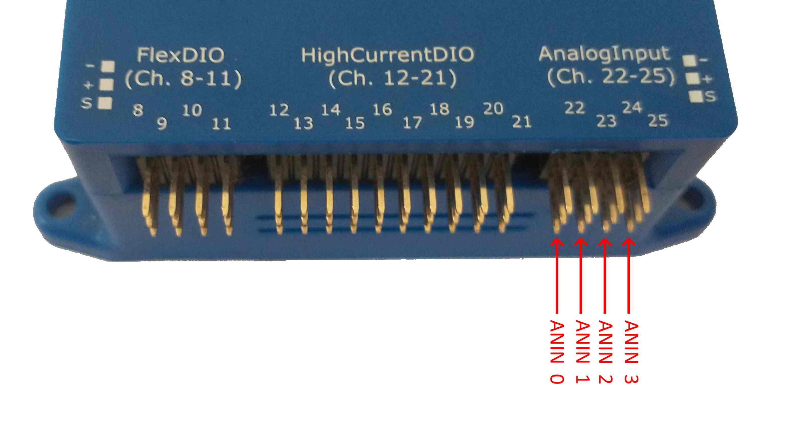
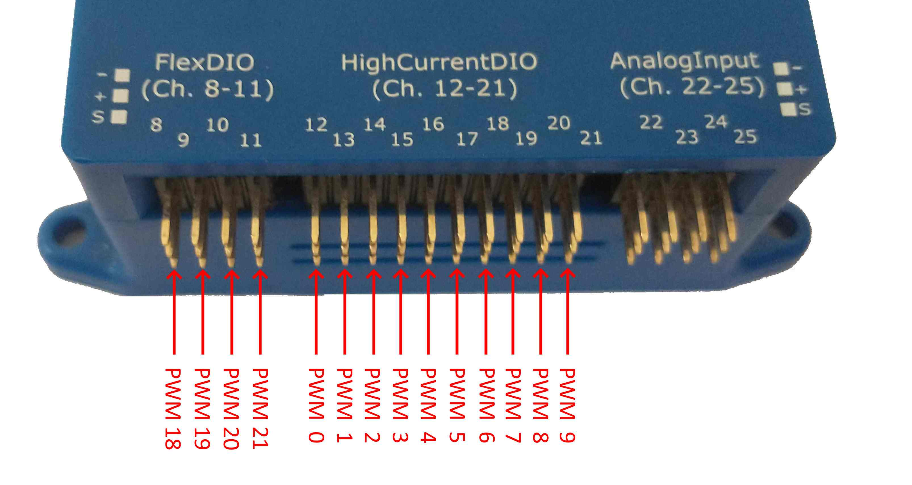
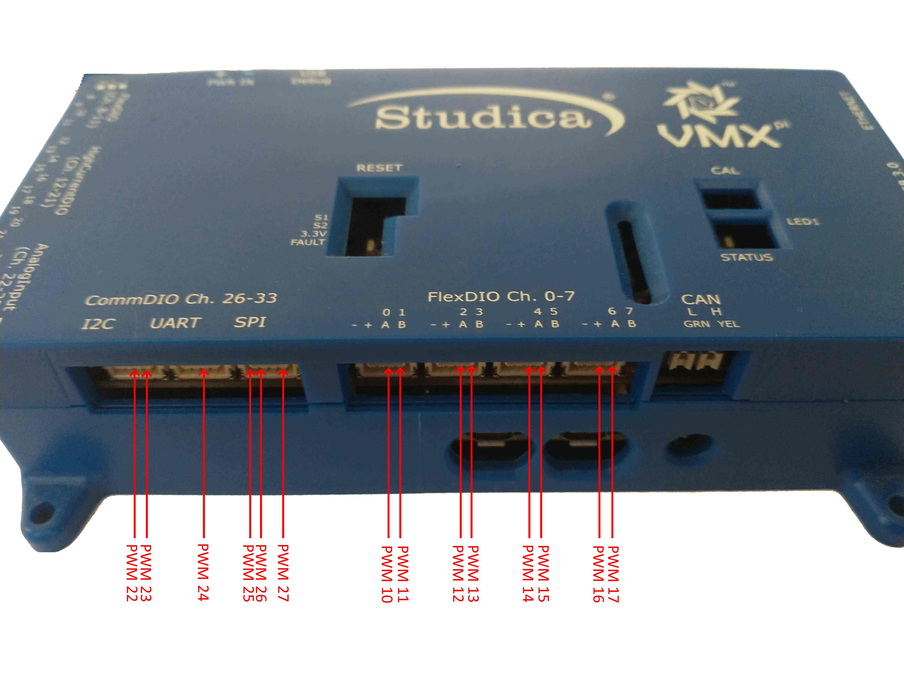
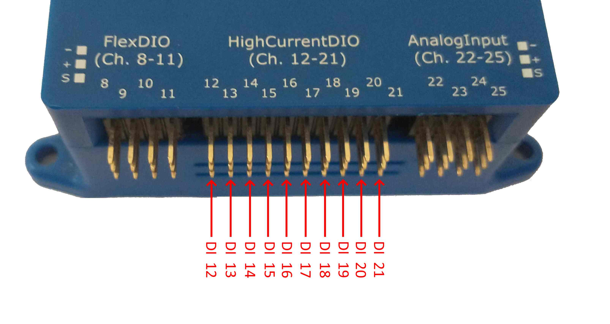
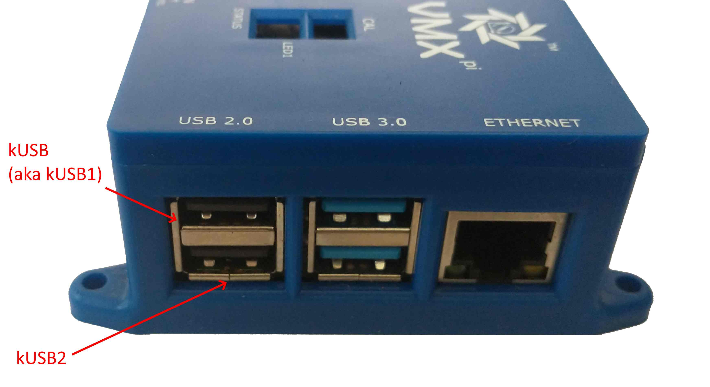

WPI Channel Addressing
======================

When programming a robot application using the WPI Library, logical *WPI Channel Numbers* are used; these WPI Channel Numbers are different than the *VMX Pin Numbers* described in :ref:`vmx-electrical-wiring`.

.. important:: *WPI Channel Addressing is impacted by whether the High-Current DIO Direction Selection Jumper is set to OUTPUT or INPUT.*

Similarly, WPI Channel Identifiers are also used to address Digital Communications Ports.

High Current DIO Header OUTPUT DIRECTION (Default)
--------------------------------------------------
When the VMX High Current DIO Direction is set to OUTPUT, the various WPI Library Channel types (Analog Input, PWM, Relay, Digital IO) must be addressed as described in this section.

Analog Input Channel Addressing
*******************************
Four (4) Pins on the VMX Analog Input Header are addressable via four (4) WPI Library Analog Input Channel Addresses.

   WPI Library Analog Input Channel Addressing

PWM Channel Addressing
**********************
28 VMX pins are usable for PWM and are addressable via 28 WPI Library PWM Channel Addresses.

   FlexDIO Header and High-Current DIO Header WPI Library PWM Channel Addressing

   CommDIO and FlexDIO Connector WPI Library PWM Channel Addressing

.. note::  The High-Current Output Direction must be set to OUTPUT to use pins on the High-Current Header as PWM Generators.

Digital I/O (DIO) Channel Addressing
************************************
30 VMX pins are usable for Digital I/O Channels and are addressable via 30 WPI Libray DIO Channel Addresses.

.. note:: All FlexDIO pins are direction-selectable in software.

.. note:: When configured in the OUTPUT Direction, the High Current DIO Pins only have Output Capability.

.. note:: Each CommDIO Pin is either an Output or an Input.  

.. figure:: images/FlexDIO_HCDIO_And_AnalogIn_Headers_Trimmed_WPIChannels_DO.jpg
   :align: center
   :width: 500

   FlexDIO Header and High-Current DIO Header WPI Library DIO Channel Addressing

.. figure:: images/CommDIO_FlexDIO_And_CAN_Connectors_Trimmed_WPIAddressing_DIO.jpg
   :align: center
   :width: 500

   CommDIO and FlexDIO Connector WPI Library DIO Channel Addressing

Relay Channel Addressing
************************
8 pins on the VMX High Current DIO Header are usable as 4 Relay Channel pairs – each with a forward direction pin and a reverse direction pin – and are addressable via 4 WPI Library Relay Channel Addresses.

.. figure:: images/FlexDIO_HCDIO_And_AnalogIn_Headers_Trimmed_WPIChannels_Relays.jpg
   :align: center
   :width: 500

   High-Current DIO Header WPI Library Relay Channel Addressing

Limits on Quadrature Encoders and Counters
------------------------------------------

Quadrature Encoder Configuration
********************************
Up to 5 Quadrature Encoders are supported. Quadrature Encoders A & B Inputs must be connected to adjacent pairs of FlexDIO Digital Input Channels; the following FlexDIO Digital Input Channel pairs may be used for Quadrature Encoders:

DI 0 and 1

DI 2 and 3

DI 4 and 5

DI 6 and 7

DI 8 and 9

The lower-numbered channel of each pair should be connected to Quadature Encoder Channel A, and the higher-numbered channel should be connected to Quadrature Encoder Channel B.

Counter Configuration
*********************
Up to 6 Counters are supported. Each Counter is internally connected to a adjacent pairs of FlexDIO Digital Input Channels. The following FlexDIO Digital Input Channel pairs may be used for Counters:

==========================  =============================================== 
Counter Input Channel Pair  Supported WPI Library Counter Modes
==========================  ===============================================
DI 0 & 1                    kTwoPulse [1]_, kSemiPeriod, kExternalDirection     
DI 2 & 3                    kTwoPulse [1]_, kSemiPeriod, kExternalDirection
DI 4 & 5                    kTwoPulse [1]_, kSemiPeriod, kExternalDirection
DI 6 & 7                    kTwoPulse [1]_, kSemiPeriod, kExternalDirection    
DI 8 & 9                    kTwoPulse [1]_, kSemiPeriod, kExternalDirection     
DI 10 & 11                  kTwoPulse [1]_, kSemiPeriod
==========================  ===============================================

.. [1] kTwoPulse mode using two separate input signals (e.g., one “Up” input signal and a separate “Down” input signal) are not supported. However, a single input configured as both “Up” and “Down” is supported.

.. note:: kPulseLength mode is not supported on any VMX Counter. By extension, this implies that the “Direction Sensitive” mode of the WPI Library’s “Geartooth” class is not supported.

.. note:: If configuring a counter to use one input channel (e.g., kTwoPulse or kSemiPeriod modes), the unused input channel in that Counter’s Channel Pair may be configured in software for other uses (including Digital Input, Interrupt, Digital Output), although it may not be configured for PWM Generation or PWM Capture.

High Current DIO Header INPUT DIRECTION
---------------------------------------

When the High Current DIO Direction Jumper is set to INPUT, the WPI Library Channel Addressing is impacted as follows:

WPI Library PWM Channels 0-9 are **NOT PRESENT** in INPUT MODE.

WPI Library Relay Channels are **NOT PRESENT** in INPUT MODE.

WPI Library Digital IO Channels on the HiCurrDIO Header are in *INPUT MODE ONLY* in INPUT MODE, as shown below:

   High-Current DI Header WPI Library DIO Channel Addressing (when in INPUT MODE)

Digital Communication Port Addressing
-------------------------------------
VMX provides several different types of Digital Communications Ports:

- Serial Ports
- I2C Port
- SPI Port

Serial Ports
************

The WPI Library *SerialPort* class includes Serial Port Identifiers, as follows:

==========================  ===============  =============================================
Serial Port Identifier      Type             Notes
==========================  ===============  =============================================
kOnboard                    RS-232 Port      Not implemented on VMX
kMXP                        TTL UART         VMX CommDIO "UART" Connector 
kUSB                        USB Serial Port  Raspberry Pi "top-left" USB port; aka 'kUSB1'
kUSB1                       USB Serial Port  Raspberry Pi "top left" USB port
kUSB2                       USB Serial Port  Raspberry Pi "bottom left" USB port
==========================  ===============  =============================================
 
.. note:: As can be seen in the table above, both kUSB and kUSB1 identifiers map to the same physical connector, and thus cannot be used simultaneously.

The Raspberry Pi 4 provides multiple USB Ports which support the USB Serial Port standard; the WPI Serial Port Identifiers which are mapped to these USB Ports are shown below:

   Raspberry Pi USB Port WPI Library Serial Port Addressing

TTL UART Communication Speeds
~~~~~~~~~~~~~~~~~~~~~~~~~~~~~
Available TTL UART Communication speeds can be as high as 230400 bits/sec. Note that the TTL UART-capable device connected to VMX may only communicate at a lower speed than 230400 kbps; consult the external device technical documentation for further details.

USB Serial Port Communication Speeds
~~~~~~~~~~~~~~~~~~~~~~~~~~~~~~~~~~~~
USB Serial Port Communication Speeds can be much higher than TTL UART Communication Speeds, and are variable depending upon USB bus usage and the capabilities of the connected device; users do not specify USB Serial Port communication speeds.

I2C Port
********

VMX provides one I2C port.

The WPI Library *I2C* class includes two (2) I2C Port identifiers, as follows:

==========================  =================  =============================================
Serial Port Identifier      Type               Notes
==========================  =================  =============================================
kOnboard                    I2C Fast Mode[2]_  VMX CommDIO “I2C” Connector
kMXP                        I2C Fast Mode[2]_  VMX CommDIO “I2C” Connector 
==========================  =================  =============================================

.. [2] See I2C Communication Speeds section below.

.. note:: As can be seen in the table above, both kOnboard and kMXP identifiers map to the same physical connector, and thus cannot be used simultaneously.

.. note:: The Raspberry Pi 4B supports I2C clock-stretching, however previous versions of Raspberry Pi do not. If the I2C device accessed requires I2C clock stretching, Raspberry Pi 4B is required.

I2C Communication Speeds
~~~~~~~~~~~~~~~~~~~~~~~~
By default, the Raspberry Pi I2C bus speed is 100Khz (“Standard Mode”). To change the bus speed to 400Khz (Fast Mode) follow `these I2C bus speed configuration instructions <https://www.raspberrypi-spy.co.uk/2018/02/change-raspberry-pi-i2c-bus-speed/>`_. Note that the I2C-capable device connected to VMX may only communicate at a lower speed than 400Khz; consult the external device technical documentation for further details.

SPI Port
********

VMX provides one SPI port.

The WPI Library “SPI” class includes five (5) SPI Port identifiers, as follows:

==========================  =================  =============================================
Serial Port Identifier      Type               Notes
==========================  =================  =============================================
kOnboardCS0                 4-wire SPI         VMX CommDIO “SPI” Connector
kOnboardCS1                 4-wire SPI         VMX CommDIO “SPI” Connector
kOnboardCS2                 4-wire SPI         VMX CommDIO “SPI” Connector
kOnboardCS3                 4-wire SPI         VMX CommDIO “SPI” Connector
kMXP                        4-wire SPI         VMX CommDIO “SPI” Connector
==========================  =================  =============================================

.. note:: As can be seen in the table above, each kOnboardx and kMXP identifiers map to the same physical connector, and thus cannot be used simultaneously.

SPI Communication Speeds
~~~~~~~~~~~~~~~~~~~~~~~~
The Raspberry pi supports a wide range of SPI speeds.

By default, the WPI Library SPI class defaults to 500Khz, but this can be increased as necessary.

Although higher speeds are theoretically possible, 16Mhz is considered a safe maximum speed, and lower is recommended due since very fast signals can be easily degraded. Note that the SPI-capable device connected to VMX may only communicate at a lower speed than 16Mhz; consult the external device technical documentation for further details.

Note that the actual speed may not match the requested speed; more information on the actual speeds is contained within the `Raspberry Pi SPI Documentation <https://www.raspberrypi.org/documentation/hardware/raspberrypi/spi/README.md>`_.
