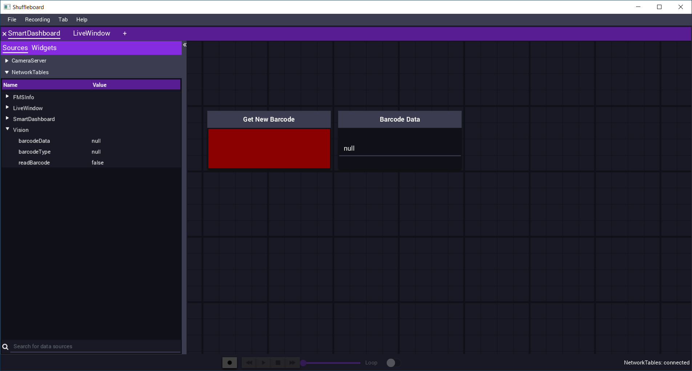
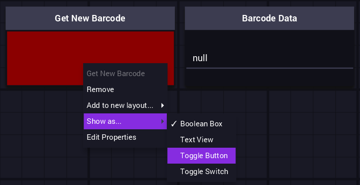
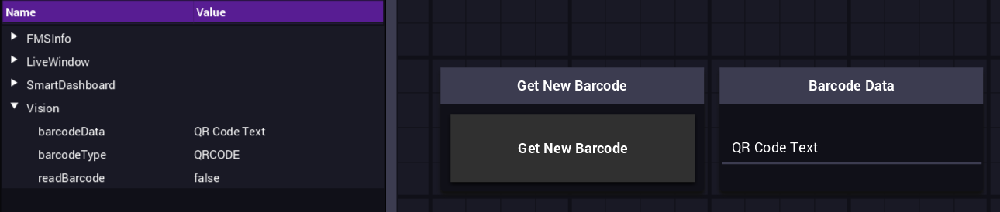

Reading a Barcode
=================

Once code is deployed to the robot and the vision scripts are set up correctly, it is possible to read a barcode or QR Code. Using the ``Control Station Console`` the code can be enabled for the system to work. 

Shuffleboard Setup
------------------

When connected to the VMX via WiFi AP and the ``Control Station Console`` is launched, and the correct IP address is used. Shuffleboard will launch and connect to the network tables stream of data. 

On launch, it should look similar to this. 

There will be two widgets in the middle. A widget called ``Get New Barcode`` and a widget called ``Barcode Data``. The ``Get New Barcode`` widget will have a red value. The widget is currently an indicator showing a false value. ``Barcode Data`` is also an indicator widget; however, it displays a string value of **null**. 

On the left of the window, the Vision tables and properties created by the ``watchdogListener.py`` can be seen. 

Changing Get New Barcode to a Button
^^^^^^^^^^^^^^^^^^^^^^^^^^^^^^^^^^^^

Having ``Get New Barcode`` as an indicator won't work here. To fix this in Shuffleboard, the widget can be configured as a toggle button.

Right, click on the **red** part of the widget, select ``Show as...`` and chose ``Toggle Button``.

This changes the ``Get New Barcode`` to a toggle button that can be pressed to get a new barcode.

.. figure:: images/reading-a-barcode-3.png
    :align: center

Enable the Robot 
----------------

The ``Get New Barcode`` button will do nothing until the robot is enabled. Using ``Control Station Console`` ensure that it is in Teleoperated mode (press ``o`` on the keyboard). When in the correct mode and connected to the robot, hit ``e`` on the keyboard to enable the robot. 

.. figure:: images/reading-a-barcode-4.png
    :align: center

Once enabled, the Shuffleboard will be able to be used.

Reading Barcodes
----------------

For this demo, there are two types of barcodes being used, a **CODE 128** barcode with the text ``Another Barcode``, and a **QR Code** with the text ``QR Code Text``. 

Test 1
^^^^^^

While connected to the VMX and the robot enabled. Hitting the ``Get New Barcode`` button returns the result. 

The result is ``QR Code Text``, and if looking at the left panel, the type is also shown to be ``QRCODE``. This is the robot successfully reading a QR Code.

Test 2
^^^^^^

The **CODE 128** barcode was placed in front of the **QR Code**, and ``Get New Barcode`` was pressed again. 

.. figure:: images/reading-a-barcode-6.png
    :align: center

The result changed to show the data as ``Another Barcode`` and on the left panel, the type is ``CODE128``. 

This demonstrates an easy way to read a barcode or QR code. This also demonstrates the framework for creating vision applications with the VMX. The VMX runs the OpenCV, TensorFlow, or custom scripts and relays the info back to the robot code via network tables. 