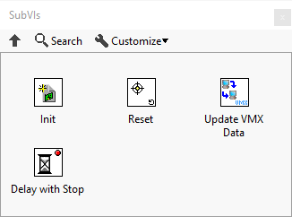
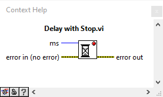

SubVIs
======

The SubVIs are some basic and device management functions.

There is four vis in the SubVIs library.

1. Init 
2. Reset
3. Update VMX Data 
4. Delay with Stop

.. list-table:: Description of SubVIs
    :widths: 30 50
    :header-rows: 1
    :align: center
   
    *  - vi
       - attributes
    *  - Init
       - Global initialization
    *  - Reset
       - Return to original state
    *  - Update VMX Data
       - Terminal communication
    *  - Delay with Stop
       - Delay Time

Init, Reset, and Update VMX Data are all simple function calls with ``error inputs`` and ``error outputs``. 

Delay with Stop has ``error inputs`` and ``error outputs``and includes an input for delay time in ``(ms)``. 

