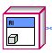

Analog Input 
============

Handles the analog inputs of the VMX.

.. figure:: images/analog-in-1.png
    :align: center

.. list-table:: Description of Digital Input and Output
    :widths: 30 50
    :header-rows: 1
    :align: center
   
    *  - vi
       - Attributes
    *  - Analog In
       - Analog signal initialization
    *  - Read
       - Analog signal reading

Analog In
^^^^^^^^^

Is a class that contains the code for reading the analog bus. Has only a ``HG_LIB`` output.

Read
^^^^

.. figure:: images/analog-in-3.png
    :align: center

A vi that allows for reading the analog value of the input pin specified by the ``Create ID`` vi.

.. list-table:: Inputs and Outputs
    :widths: 30 20 50
    :header-rows: 1
    :align: center
   
    *  - Name
       - I/O
       - Attribute
    *  - Analog In in
       - Input
       - The input cluster from Create ID
    *  - error in (no error)
       - Input
       - The error input cluster
    *  - Analog In out
       - Output
       - The output cluster to go to Delete ID
    *  - Data
       - Output
       - The raw value from the ADC
    *  - IR
       - Output
       - The converted value displaying distance in mm
    *  - error out
       - Output
       - The error output cluster

Analog Input Example
---------------------

This example will read an analog signal from a Sharp IR Sensor connected to analog port 0 (Digital port 22) on the VMX.

.. figure:: images/analog-read-example.png
    :align: center