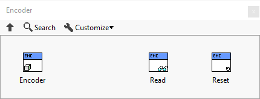
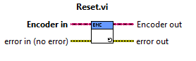
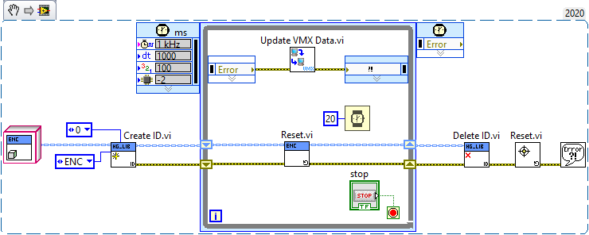

VMX Encoder 
===========

Handles the Encoder ports on the VMX. There are five encoder ports on the VMX.

1. FlexDIO 0,1
2. FlexDIO 2,3
3. FlexDIO 4,5
4. FlexDIO 6,7
5. FlexDIO 8,9 (LabVIEW currently does not use this one)

.. list-table:: Description of VMX Encoder
    :widths: 30 50
    :header-rows: 1
    :align: center
   
    *  - vi
       - Attributes
    *  - Encoder
       - Encoder initialization
    *  - Read
       - Encoder reading
    *  - Reset
       - Encoder reset

Encoder
^^^^^^^

.. figure:: images/encoder-2.png
    :align: center

Is a class that contains the code for reading the encoder ports on the VMX. Has only a ``HG_LIB`` output.

Read
^^^^

.. figure:: images/encoder-3.png
    :align: center

A vi that allows for reading the encoder count from the port specified by the ``Create ID`` vi.

.. list-table:: Inputs and Outputs
    :widths: 30 20 50
    :header-rows: 1
    :align: center
   
    *  - Name
       - I/O
       - Attribute
    *  - Encoder in
       - Input
       - The input cluster from Create ID
    *  - error in (no error)
       - Input
       - The error input cluster
    *  - Encoder out
       - Output
       - The output cluster to go to Delete ID
    *  - ENC
       - Output
       - The raw encoder count
    *  - ENC/dt
       - Output
       - The delta change in encoder count
    *  - error out
       - Output
       - The error output cluster

Reset
^^^^^

A vi that allows for resetting the encoder count from the port specified by the ``Create ID`` vi.

.. list-table:: Inputs and Outputs
    :widths: 30 20 50
    :header-rows: 1
    :align: center
   
    *  - Name
       - I/O
       - Attribute
    *  - Encoder in
       - Input
       - The input cluster from Create ID
    *  - error in (no error)
       - Input
       - The error input cluster
    *  - Encoder out
       - Output
       - The output cluster to go to Delete ID
    *  - error out
       - Output
       - The error output cluster

Encoder Read Example
--------------------

This example reads the encoder count on Encoder port 0 ``FlexDIO 0,1``.

.. figure:: images/encoder-read-example.png
    :align: center

Encoder Reset Example
---------------------

This example resets the encoder count on Encoder port 0 ``FlexDIO 0,1``.

