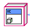

IIC / Cobra
===========

Handles the IIC communication to the external ADC connected to the Cobra sensor. 

.. figure:: images/iic-1.png
    :align: center

.. list-table:: Description of IIC
    :widths: 30 50
    :header-rows: 1
    :align: center
   
    *  - vi
       - Attributes
    *  - IIC
       - IIC initialization
    *  - Read
       - IIC reading

IIC
^^^

Is a class that contains the code for reading the Cobra on the VMX. Has only a ``HG_LIB`` output.

Read
^^^^

.. figure:: images/iic-3.png
    :align: center

A vi that allows for reading of the Cobra on the port specified by the ``Create ID`` vi.

.. list-table:: Inputs and Outputs
    :widths: 30 20 50
    :header-rows: 1
    :align: center
   
    *  - Name
       - I/O
       - Attribute
    *  - IIC in
       - Input
       - The input cluster from Create ID
    *  - error in (no error)
       - Input
       - The error input cluster
    *  - IIC out
       - Output
       - The output cluster to go to Delete ID
    *  - QTI
       - Output
       - An array with all four values of the Cobra
    *  - error out
       - Output
       - The error output cluster

IIC Read Example
----------------

This example reads the values on the Cobra.

.. figure:: images/iic-example.png
    :align: center