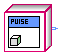
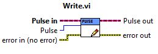

Pulse / Ultrasonic
==================

Handles the pulse of the Ultrasonic sensor. 

.. figure:: images/pulse-1.png
    :align: center

.. list-table:: Description of Pulse
    :widths: 30 50
    :header-rows: 1
    :align: center
   
    *  - vi
       - Attributes
    *  - Pulse
       - Pulse initialization
    *  - Pulse
       - Pulse output

Pulse Init 
^^^^^^^^^^

Is a class that contains the code for sending out the Ultrasonic pulse on the VMX. Has only a ``HG_LIB`` output.

Pulse Output
^^^^^^^^^^^^

A vi that allows for sending out the Ultrasonic pulse on the port specified by the ``Create ID`` vi.

.. list-table:: Inputs and Outputs
    :widths: 30 20 50
    :header-rows: 1
    :align: center
   
    *  - Name
       - I/O
       - Attribute
    *  - Pulse in
       - Input
       - The input cluster from Create ID
    *  - Pulse
       - Input
       - The pulse to set
    *  - error in (no error)
       - Input
       - The error input cluster
    *  - Pulse out
       - Output
       - The output cluster to go to Delete ID
    *  - error out
       - Output
       - The error output cluster

Ultrasonic Example
------------------

.. note:: This example requires Pulse and ISQ.

This example will Pulse the Ultrasonic sensor on digital port 12 and receive the echo on digital port 8 then calulate the distance.

.. figure:: images/ultrasonic-example.png
    :align: center