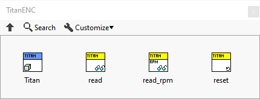
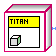
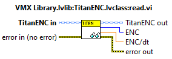
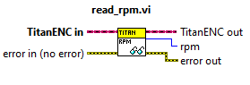
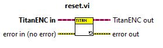
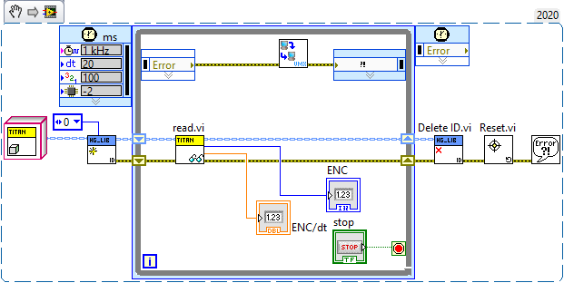
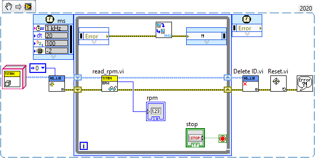
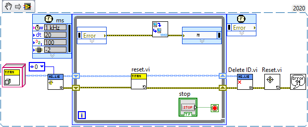

Titan Encoder 
=============

Handles the Encoder ports on the Titan.

.. note:: While the Titan Encoder inputs are accurate on the Titan, with the CAN bus propagation delay, there will be a delay between the actual count and the count read on the VMX. If you require immediate counts plug your encoders into the FlexDIO ports directly on the VMX. 

.. list-table:: Description of TitanENC
    :widths: 30 50
    :header-rows: 1
    :align: center
   
    *  - vi
       - Attributes
    *  - Encoder
       - Titan Encoder initialization
    *  - Read
       - Titan Encoder reading
    *  - Read RPM
       - Titan Encoder rpm reading
    *  - Reset
       - Titan Encoder reset

TitanENC
^^^^^^^^

Is a class that contains the code for reading the encoder ports on the Titan. Has only a ``HG_LIB`` output.

Read
^^^^

A vi that allows for reading the encoder count from the port specified by the ``Create ID`` vi.

.. list-table:: Inputs and Outputs
    :widths: 30 20 50
    :header-rows: 1
    :align: center
   
    *  - Name
       - I/O
       - Attribute
    *  - TitanENC in
       - Input
       - The input cluster from Create ID
    *  - error in (no error)
       - Input
       - The error input cluster
    *  - TitanENC out
       - Output
       - The output cluster to go to Delete ID
    *  - ENC
       - Output
       - The raw encoder count
    *  - ENC/dt
       - Output
       - The delta change in encoder count
    *  - error out
       - Output
       - The error output cluster

Read_RPM
^^^^^^^^

A vi that allows for reading the encoder rpm count from the port specified by the ``Create ID`` vi.

.. list-table:: Inputs and Outputs
    :widths: 30 20 50
    :header-rows: 1
    :align: center
   
    *  - Name
       - I/O
       - Attribute
    *  - TitanENC in
       - Input
       - The input cluster from Create ID
    *  - error in (no error)
       - Input
       - The error input cluster
    *  - TitanENC out
       - Output
       - The output cluster to go to Delete ID
    *  - rpm
       - Output
       - The rpm of the motor reported by the Titan
    *  - error out
       - Output
       - The error output cluster

Reset
^^^^^

A vi that allows for resetting the encoder count from the port specified by the ``Create ID`` vi.

.. list-table:: Inputs and Outputs
    :widths: 30 20 50
    :header-rows: 1
    :align: center
   
    *  - Name
       - I/O
       - Attribute
    *  - TitanENC in
       - Input
       - The input cluster from Create ID
    *  - error in (no error)
       - Input
       - The error input cluster
    *  - TitanENC out
       - Output
       - The output cluster to go to Delete ID
    *  - error out
       - Output
       - The error output cluster

Encoder Read Example
--------------------

This example reads the encoder count on Titan Encoder port 0.

Encoder Read_RPM Example
------------------------

This example reads the encoder rpm on Titan Encoder port 0.

Encoder Reset Example
---------------------

This example resets the encoder count on Titan Encoder port 0.

