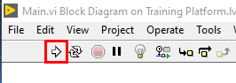

Deploying Code to the VMX
=========================

To deploy code to the VMX, ensure that there is a connection first. See `Connecting to the VMX <https://docs.wsr.studica.com/en/latest/docs/labview/using-labview/connecting-to-the-vmx.html>`__ if no connection is present. 

In the upper left-hand corner, there will be an arrow facing right.

Press the arrow, and the code will deploy to the VMX. 

.. note:: If you are connected in LabVIEW, the Front Panel will be usable for diagnosing functions and seeing values.

.. important:: Deploying sets the current code as the startup code. Meaning this code will run automatically when the VMX is powered on again. 
   